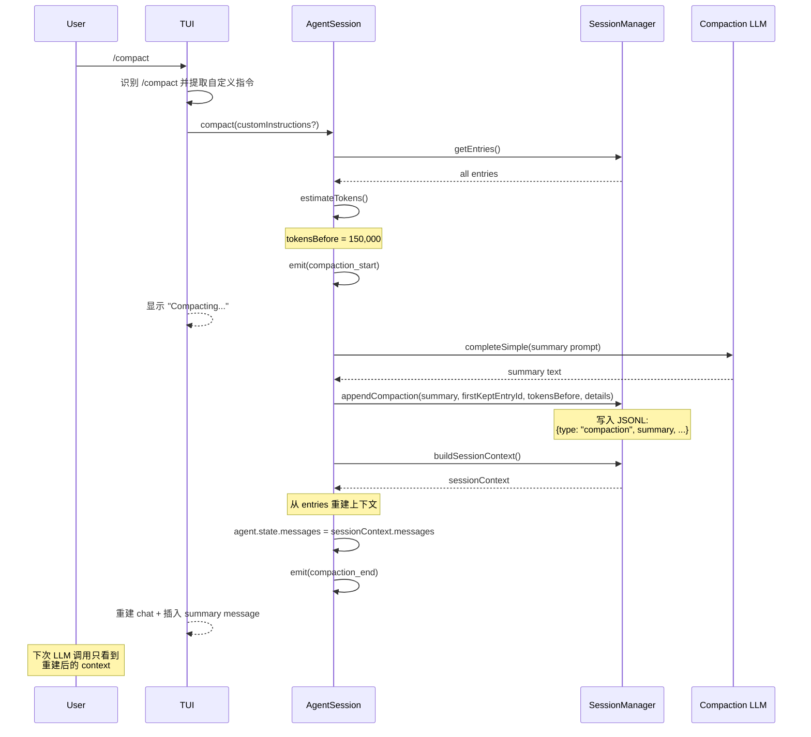

# 附录

## A. 核心类型速查表

### pi-ai 层

| 类型 | 文件 | 用途 | 关键字段 |
|------|------|------|---------|
| `Model<TApi>` | types.ts | 模型定义 | `id: string` — 唯一标识（如 `claude-sonnet-4-5`）<br>`provider: string` — 提供方（如 `anthropic`）<br>`api: TApi` — API 类型标记<br>`cost: { input, output, cacheRead, cacheWrite }` — 每 token 价格<br>`contextWindow: number` — 上下文窗口大小<br>`maxOutput?: number` — 最大输出 token 数 |
| `Context` | types.ts | LLM 调用上下文 | `systemPrompt?: string` — 可选系统提示词<br>`messages: Message[]` — 对话历史<br>`tools?: Tool[]` — 可用工具定义 |
| `AssistantMessageEvent` | types.ts | 流式事件 | `start` — 初始化 partial assistant message<br>`text_* / thinking_* / toolcall_*` — 分块流式更新<br>`done` — 成功结束并携带最终消息<br>`error` — 失败或中止结束并携带错误消息 |
| `StreamFunction` | types.ts | Provider 必须实现的流式函数 | 签名：`(model, context, options?) => AssistantMessageEventStream`<br>契约：返回事件流，不通过抛异常传递运行期错误 |
| `Usage` | types.ts | Token 使用量 | `input: number` — 输入 token<br>`output: number` — 输出 token<br>`cacheRead: number` — 缓存读取<br>`cacheWrite: number` — 缓存写入<br>`cost: { input, output, cacheRead, cacheWrite, total }` |

### pi-agent-core 层

| 类型 | 文件 | 用途 | 关键字段 |
|------|------|------|---------|
| `AgentMessage` | types.ts | 扩展消息类型 | 联合类型：`Message \| CustomAgentMessages[...]`<br>标准消息来自 `pi-ai`：`user / assistant / toolResult`<br>产品层可通过声明合并追加自定义消息 |
| `AgentTool<TParams>` | types.ts | 工具定义 | `name: string` — 工具名称<br>`parameters: TParams` — 参数（继承 Tool\<TParameters\>）<br>`label: string` — UI 显示的可读名称<br>`prepareArguments?: (args) => Static<TParams>` — 可选的参数预处理<br>`execute(toolCallId, params, signal, onUpdate): Promise<AgentToolResult>` — 执行函数 |
| `AgentEvent` | types.ts | 循环生命周期事件 | `type` 联合：<br>`agent_start / agent_end` — 本轮运行开始/结束<br>`turn_start / turn_end` — 一轮 assistant turn 开始/结束<br>`message_start / message_update / message_end` — 消息流式生命周期<br>`tool_execution_start / tool_execution_update / tool_execution_end` — 工具执行生命周期 |
| `AgentLoopConfig` | types.ts | 循环引擎配置 | `model: Model` — 本轮使用的模型<br>`convertToLlm` — `AgentMessage[] -> Message[]` 转换<br>`transformContext?` — LLM 调用前的上下文变换<br>`beforeToolCall? / afterToolCall?` — 工具调用前后钩子<br>`getSteeringMessages? / getFollowUpMessages?` — 运行中注入消息 |
| `AgentState` | agent.ts | Agent 可变状态 | `systemPrompt: string` — 当前系统提示词<br>`model: Model` — 当前模型<br>`thinkingLevel: ThinkingLevel` — 后续 turn 的思考级别<br>`tools` / `messages` — 以 copy-on-assign 方式暴露的数组状态<br>`isStreaming / streamingMessage / pendingToolCalls / errorMessage` — 当前运行态 |

### pi-coding-agent 层

| 类型 | 文件 | 用途 | 关键字段 |
|------|------|------|---------|
| `SessionEntry` | session-manager.ts | 会话持久化条目 | 9 种类型联合：<br>`message` — 用户/助手消息<br>`thinking_level_change` — 思考级别变更<br>`model_change` — 模型切换<br>`compaction` — 压缩记录<br>`branch_summary` — 分支摘要<br>`custom` — 自定义条目<br>`custom_message` — 自定义消息<br>`label` — 标签<br>`session_info` — 会话信息<br>每条有 `id`, `parentId`, `timestamp` |
| `AgentSessionEvent` | agent-session.ts | 产品层事件 | `AgentEvent` 的超集：额外包含 `queue_update`、`compaction_start / compaction_end`、`auto_retry_start / auto_retry_end` |
| `AgentSession` | agent-session.ts | 产品层 agent 包装 | 组合了 `Agent` + `SessionManager` + `SettingsManager`<br>`prompt(text, options?)` — 发送消息并运行循环<br>`compact(customInstructions?)` — 主动触发压缩<br>`subscribe(listener)` — 订阅 `AgentSessionEvent`<br>`abort()` — 中止当前循环 |
| `Skill` | skills.ts | 能力扩展定义 | `name: string` — 技能名称<br>`description: string` — 描述<br>`filePath: string` — SKILL.md 路径<br>`baseDir: string` — 技能目录<br>`sourceInfo` — 来源信息<br>`disableModelInvocation` — 是否从 prompt 中隐藏 |
| `Extension` | core/extensions/types.ts | 运行时扩展 | `name: string` — 扩展名称<br>`setup(api)` — 初始化函数<br>API 提供：`registerTool`, `registerCommand`, `on(event, handler)` 等 |

## B. 设计模式索引

| 模式 | 出现位置 | 章节 | 模式说明 |
|------|---------|------|---------|
| 插件注册（Map + register/get） | api-registry.ts, oauth/index.ts | 第 4、7 章 | 用注册表 `Map` 存储，`register()` 添加，`get()` 查找。api-registry 按 `api` 键控，不用 DI 框架，不用反射 |
| 有损变换（isSameModel 判断） | transform-messages.ts | 第 5 章 | 跨模型消息变换时，标记信息丢失（如 thinking 块），便于下游处理 |
| 流式契约（Must not throw） | StreamFn type, AgentLoopConfig | 第 6、8 章 | Provider 的 stream 函数承诺不抛异常，错误通过事件流传递。调用方不需要 try-catch |
| 双层循环（steering + follow-up） | agent-loop.ts runLoop() | 第 8 章 | 外层 steering 循环处理模型切换和重试，内层 follow-up 循环处理工具调用后的后续对话 |
| 三阶段工具执行（prepare/execute/finalize） | agent-loop.ts | 第 9 章 | prepare 获取资源/确认权限，execute 执行操作，finalize 清理/格式化结果。任何阶段可中止 |
| 声明合并扩展（CustomAgentMessages） | types.ts | 第 10 章 | TypeScript `declare module` + interface merging，让产品层添加自定义消息类型而不修改内核 |
| Copy-on-assign（getter/setter + slice） | agent.ts MutableAgentState | 第 10 章 | 读取 `messages` 返回浅拷贝，赋值 `messages = [...]` 替换整个数组。防止外部意外修改内部状态 |
| Append-only 树（JSONL + parentId） | session-manager.ts | 第 11 章 | 每条记录有唯一 id 和 parentId。新分支从分支点的 id 开始，旧分支保留不删除。JSONL 格式支持崩溃恢复 |
| 三级配置覆盖（全局/项目/目录） | settings-manager.ts, resource-loader | 第 13 章 | 全局配置 < 项目配置 < 目录配置。就近原则，越具体越优先。类似 CSS 的层叠覆盖 |
| Pluggable I/O（EditOperations, BashOperations） | edit.ts, bash.ts, find.ts | 第 19-23 章 | 工具不直接调用 `fs` 或 `child_process`，而是通过接口注入。测试用 mock，Docker 用远程执行 |
| 极简组件接口（Component） | tui.ts | 第 24 章 | UI 组件实现 `render(width: number): string[]`，可选 `handleInput?(data)`，并要求实现 `invalidate()`。没有虚拟 DOM、没有状态管理框架 |
| 消息队列串行化 | agent.ts (mom) | 第 28 章 | 所有 Slack API 调用通过 Promise 链串行执行，避免消息乱序。`enqueue()` 返回 void，错误内部处理 |
| 委托模式（DockerExecutor → HostExecutor） | sandbox.ts | 第 28 章 | DockerExecutor 把命令包装为 `docker exec`，委托给 HostExecutor 执行。关注点分离 |

## C. 一次完整请求的时序图

```mermaid
sequenceDiagram
    participant User
    participant Editor as Editor - TUI
    participant Agent as Agent
    participant Loop as agentLoop
    participant Transform as transformContext
    participant Convert as convertToLlm
    participant Provider as LLM Provider
    participant Tool as Tool Execute
    participant Session as SessionManager

    User->>Editor: 输入消息 + Enter
    Editor->>Agent: agent.prompt(msg)
    Note over Agent: 添加用户消息到 state.messages
    Agent->>Loop: runAgentLoop(prompts, context, config)
    
    rect rgb(230, 245, 255)
        Note over Loop,Convert: 上下文准备阶段
        Loop->>Transform: transformContext(messages)
        Note over Transform: 可注入 plan 指令、截断历史、<br/>过滤敏感信息
        Transform-->>Loop: pruned messages
        Loop->>Convert: convertToLlm(messages)
        Note over Convert: AgentMessage → ai 层 Message<br/>过滤/转换应用层消息
        Convert-->>Loop: LLM-compatible messages
    end
    
    rect rgb(255, 245, 230)
        Note over Loop,Provider: 模型调用阶段
        Loop->>Provider: streamSimple(model, context)
        Note over Provider: HTTP SSE 流式调用
        Provider-->>Loop: events (text_delta, toolcall_end, done)
        Loop->>Agent: emit(message_end)
        Agent->>Session: persist entry
    end
    
    alt has tool calls
        rect rgb(230, 255, 230)
            Note over Loop,Tool: 三阶段工具执行
            Loop->>Tool: prepareToolCall()
            Note over Tool: 获取资源、权限检查<br/>beforeToolCall 钩子在此触发
            Tool-->>Loop: prepared (or denied)
            Loop->>Tool: executePreparedToolCall()
            Note over Tool: 实际执行操作<br/>（bash 命令、文件读写等）
            Tool-->>Loop: result
            Loop->>Tool: finalizeExecutedToolCall()
            Note over Tool: 格式化结果、截断过长输出
            Tool-->>Loop: final result
        end
        Loop->>Agent: emit(tool_execution_end)
        Note over Agent: UI / extension 观察工具完成
        Loop->>Agent: emit(message_end)
        Agent->>Session: persist toolResult message
        Note over Loop: 回到上下文准备阶段，进入下一轮
        Loop->>Provider: next LLM call (with tool results)
    end
    
    Loop->>Agent: emit(agent_end)
    Agent->>Session: session complete
    Agent->>Editor: render final state
```

### 关键节点说明

1. **transformContext 是 `AgentMessage[]` 级的预处理点**。裁剪历史、注入额外上下文、实现 plan-like 控制通常放在这里
2. **convertToLlm 是 `AgentMessage[] -> Message[]` 的边界转换**。它负责过滤或改写应用层消息；真正的跨 provider 兼容处理还会在 `pi-ai` 的 provider 层继续发生
3. **三阶段工具执行保证了安全性**。prepare 阶段可以拒绝执行（beforeToolCall 钩子），execute 阶段实际操作，finalize 阶段格式化输出
4. **事件驱动的持久化主要挂在 `message_end` 上**。`tool_execution_end` 主要用于 UI 和 extension 观测，真正写入会话的是随后产生的 `toolResult` 消息

## D. `/compact` 命令的端到端追踪

下面追踪用户在 pi CLI 中输入 `/compact` 命令时，系统内部发生的完整过程。

### Phase 1：命令解析

```
用户输入: /compact
    ↓
interactive-mode: 识别 `/compact` 或 `/compact ...`
    ↓
handleCompactCommand(customInstructions)
    ↓
AgentSession.compact(customInstructions?)
```

`/compact` 不经过 agent 循环本身。它先由 interactive mode 在本地识别，再直接调用 `AgentSession.compact(...)`。

### Phase 2：Compaction 触发

```
compact handler
    ↓
SessionManager.getEntries()  → 获取当前所有会话条目
    ↓
estimateTokens(messages)     → 估算当前 context token 数
    ↓
Agent.state.messages         → 获取当前消息列表
    ↓
emit("compaction_start", { reason: "manual" })
```

### Phase 3：LLM 总结

```
compaction_start 事件
    ↓
构建 compaction prompt:
  "请总结以下对话的关键信息..."
  + 当前所有消息
    ↓
completeSimple(compactionModel, compactionContext)
  → 调用 LLM 生成总结
    ↓
收集 LLM 输出 → summary text
```

Compaction 使用的模型可能和主对话模型不同（通常用更快更便宜的模型）。

### Phase 4：状态更新

```
summary text
    ↓
SessionManager.appendCompaction(
  summary,
  firstKeptEntryId,
  tokensBefore,
  details?
)
  → 将 compaction 记录追加到 JSONL
    ↓
buildSessionContext()
  → 从 entries 重建完整的 session context
    ↓
agent.state.messages = sessionContext.messages
  → 用重建后的消息列表替换 agent 状态
    ↓
emit("compaction_end", { result: { summary, firstKeptEntryId, tokensBefore, details } })
```

### Phase 5：UI 更新

```
compaction_end 事件
    ↓
TUI 订阅者收到事件
    ↓
清空并重建 chat
    ↓
插入 compaction summary message
    ↓
刷新 footer / 状态显示
```

### 完整数据流



### 关键观察

1. `/compact` **不经过 agent 循环**。它是一次本地命令处理 + 一次独立的 LLM 调用
2. **状态重建而非直接替换**。`appendCompaction` 记录压缩事件后，`buildSessionContext()` 从 entries 重建上下文，再赋值给 `agent.state.messages`。不是直接构造一条 summary 消息替换
3. **持久化保留历史**。SessionManager 记录 compaction 事件，但不删除历史条目。JSONL 是 append-only 的，`buildSessionContext()` 负责根据 compaction 记录决定哪些 entries 构成当前 context
4. **事件驱动 UI**。TUI 不直接参与 compaction 逻辑，只订阅事件更新显示

## E. 二次开发入口清单

| 我想做什么 | 起点文件/函数 | 参考章节 |
|-----------|-------------|---------|
| 加一个新 LLM provider | `packages/ai` 中实现 provider + `registerApiProvider()` + model wiring | 第 4、18 章 |
| 加一个新工具 | Extension API → `registerTool()` | 第 15、19 章 |
| 加一个新 slash command | Extension API → `registerCommand()` | 第 15 章 |
| 改 system prompt | 创建 `SYSTEM.md` 或 `AGENTS.md` | 第 13-14 章 |
| 自定义权限策略 | `beforeToolCall` 钩子 | 第 9 章 |
| 改 compaction 策略 | Extension hook: `on("session_before_compact", handler)` | 第 12 章 |
| 加一个新 UI 模式 | 参考 `modes/rpc/` 实现新 mode | 第 26 章 |
| 支持新的消息类型 | `CustomAgentMessages` 声明合并 | 第 10 章 |
| 加一个新 OAuth provider | `registerOAuthProvider()` | 第 7 章 |
| 自定义上下文管理 | `transformContext` 回调 | 第 8 章 |
| 构建 Slack bot 产品 | 参考 `packages/mom/` 完整实现 | 第 28 章 |
| 部署自有模型 | 参考 `packages/pods/` 的 SSH + vLLM 流程 | 第 29 章 |
| 实现审计日志 | 订阅 `AgentEvent`，写入日志系统 | 第 10 章 |
| 实现成本预算控制 | `transformContext` 中检查累计 token 使用量 | 第 8 章 |
| 实现 A/B 测试（模型对比） | 在 `getModel()` 中随机选择模型 | 第 4 章 |

## F. 术语对照表

| 英文术语 | 本书用法 | 说明 |
|---------|---------|------|
| Agent Loop | 循环引擎 / agent 循环 | `agentLoop()` 函数实现的 LLM 调用 → 工具执行 → 再调用循环 |
| Compaction | 上下文压缩 | 用 LLM 总结对话历史，减少 token 使用 |
| Extension | 扩展 | 运行时代码扩展，可注册工具、命令、事件处理器 |
| Provider | 提供方 | LLM API 提供方（Anthropic、OpenAI 等） |
| Skill | 技能 | 纯 markdown 文件，注入 system prompt 引导 agent 行为 |
| Session | 会话 | 一次用户与 agent 的完整交互，持久化为 JSONL |
| Stream | 流式 | LLM 的流式响应，通过 SSE 或 WebSocket 传输 |
| Tool Call | 工具调用 | LLM 请求执行一个工具的指令 |
| Transform Context | 上下文变换 | 在 LLM 调用前修改消息列表的回调 |
| TUI | 终端 UI | Terminal User Interface，基于 ANSI 转义码的终端渲染 |

---

### 版本演化说明
> 本附录基于 pi-mono v0.66.0。类型名、文件路径、函数签名可能随版本更新而变化。
> 设计模式和二次开发入口的结构性建议预计长期有效。
