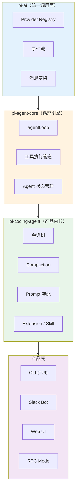

# 第 1 章：不是又一个 LLM 包装器

> **定位**：本章建立全书的阅读框架。
> 前置依赖：无。
> 适用场景：当你想快速判断"这本书值不值得读"。

## pi 到底是什么

AI 编程助手正在从"产品形态"回到"基础设施层"。市场上有上百个 AI 编码工具，但支撑它们的基础设施 — agent runtime — 仍然是一个没有共识的领域。

pi 是一个 **agent 运行时**，不是一个调用库。

调用库（LangChain、Vercel AI SDK）的核心问题是"怎么调 LLM"。Runtime 的核心问题是"调完之后怎么办" — 模型返回了工具调用，工具执行了，结果返回了，然后呢？要不要继续？要不要重试？用户在 agent 工作过程中发了新消息怎么办？上下文窗口快满了怎么办？工具执行超时了怎么办？多个工具调用之间如何排序？

这些问题没有一个能被一次 LLM API 调用解决。它们需要的是一个**运行循环** — 一个持续运转、不断决策的引擎。pi 的核心就是这样一个引擎。

这本书不讲"怎么用 pi"，而是讲 **pi 做了哪些设计决策，每个决策放弃了什么、得到了什么**。读完后你应该能判断：这些决策适不适合你的场景。

## 与同类项目的结构差异

在进入 pi 的设计细节之前，值得先看看同一领域内几个有代表性的项目在结构上的差异。这里不是评价好坏，而是指出架构选择上的不同方向。

### LangChain：链式编排

LangChain 的核心抽象是 **chain** — 一系列步骤的有向图。每个步骤可以是 LLM 调用、检索、工具执行等。开发者手动编排这些步骤的顺序和条件分支。

pi 没有 chain 的概念。pi 的循环引擎（`agentLoop`）是一个**无限循环**：调用 LLM → 执行工具 → 把结果送回 LLM → 重复，直到 LLM 决定停止。开发者不编排步骤，而是提供工具和 prompt，让 LLM 自己决定调用什么、调用几次。

结构差异在于：LangChain 的控制流是开发者定义的图（developer-defined graph），pi 的控制流是 LLM 驱动的循环（LLM-driven loop）。前者更可预测，后者更灵活。

### Vercel AI SDK：流式调用库

Vercel AI SDK 的核心是**统一的流式 LLM 调用接口**。它解决的问题是：不同 provider（OpenAI、Anthropic、Google）的 API 格式不同，AI SDK 提供统一的 `streamText` / `generateText` 入口。

pi 的 `pi-ai` 层做了类似的事 — 统一的 provider 抽象和事件流。但 pi 在这之上多了两层：`pi-agent-core`（循环引擎 + 状态管理）和 `pi-coding-agent`（产品内核）。Vercel AI SDK 止步于"怎么调 LLM"，pi 继续回答"调完之后怎么管理整个 agent 生命周期"。

结构差异在于：AI SDK 是一个**调用层**（call layer），pi 是一个**运行时**（runtime）。AI SDK 可以被 pi 替代掉底层调用部分（事实上 pi 自己实现了这层），但反过来不成立 — AI SDK 没有循环引擎。

### CrewAI：多 agent 编排

CrewAI 的核心抽象是 **crew** — 多个 agent 组成的团队，每个 agent 有角色（role）、目标（goal）和工具（tools）。框架负责协调 agent 之间的协作。

pi 明确选择**不内建 sub-agents**（第 31 章详述）。pi 认为 sub-agent 的抽象在当前阶段收益不明确 — 一个 agent 调用另一个 agent，本质上和一个 agent 调用一个工具没有区别，但引入了额外的消息传递、状态同步、错误传播等复杂性。

结构差异在于：CrewAI 是**多 agent 框架**（multi-agent framework），pi 是**单 agent 运行时**（single-agent runtime）。pi 认为单 agent + 强大的工具集 > 多个弱 agent 的协作，至少在 coding 领域是如此。

### 差异总结

| 维度 | LangChain | Vercel AI SDK | CrewAI | pi |
|------|-----------|---------------|--------|-----|
| 核心抽象 | Chain（步骤图） | StreamText（调用） | Crew（agent 团队） | AgentLoop（循环引擎） |
| 控制流 | 开发者定义 | 开发者定义 | 框架协调 | LLM 驱动 |
| 分层数 | 单层 + 插件 | 单层 | 双层 | 四层（ai → agent → coding → 产品壳） |
| 状态管理 | 外部 | 无 | 内置 | 分层（循环无状态，agent 有状态） |
| Multi-agent | 通过 LangGraph | 无 | 核心特性 | 明确不做 |

这张表不是评分卡。每个项目的选择都是对其目标场景的优化。pi 的选择优化的是**单 agent 在复杂编码任务中的深度能力**。

## 洋葱架构

pi 的设计可以用一张洋葱图概括：

每一层只知道下一层的接口，不知道上层的存在。**依赖只向内**。这条规则没有例外。

### L1：pi-ai — 统一调用面

最内层解决一个纯粹的问题：如何用统一的接口调用不同的 LLM provider。

**Provider Registry** 是一个极简的注册表（`api-registry.ts` 只有 98 行），支持 Anthropic、OpenAI、Google、Bedrock、Mistral 等。注册一个新 provider 至少要提供 `api` 标识、`stream` 和 `streamSimple` 这组接口面，然后把它们挂到注册表里。

**事件流** 是 pi-ai 的核心输出格式。无论哪个 provider，调用结果都被标准化为一系列事件：`text-delta`、`tool-call-delta`、`usage` 等。下游代码完全不需要知道底层 provider 的 API 格式。

**消息变换** 处理不同 provider 的消息格式差异。Anthropic 用 content blocks，OpenAI 用 function calling — 这些差异在 L1 内部被消化掉，上层看到的永远是统一的 `AssistantMessage`。

### L2：pi-agent-core — 循环引擎

中间层解决的问题是：LLM 返回了工具调用，然后呢？

**agentLoop** 是整个系统的心脏。它是一个 `while(true)` 循环：调用 LLM → 检查是否有工具调用 → 执行工具 → 把结果加入消息列表 → 再次调用 LLM。循环在两种情况下终止：LLM 没有产生工具调用（认为任务完成），或者外部信号要求停止。

关键设计：agentLoop **本身是无状态的**。它不持有任何跨次调用的状态。消息列表、工具定义、配置 — 全部由调用方传入。这意味着循环引擎可以被任何上层以任何方式复用（第 8 章详述）。

**工具执行管道** 负责并行执行工具、处理超时、收集结果。它不关心工具做了什么 — tool 的实际实现在上层定义。

**Agent 状态管理** 是循环引擎上面的一层薄壳。它持有消息历史、当前配置、abort 信号等。当 agentLoop 需要这些信息时，Agent 提供；当 agentLoop 产生新消息时，Agent 记录。

### L3：pi-coding-agent — 产品内核

这一层把通用的 agent 引擎变成一个具体的编码助手。

**会话树** 管理对话的分支结构。用户可以在任何一轮对话后回退、分支，形成一棵树状的会话历史。这不是 agent 引擎的通用功能，而是编码助手这个产品的需求。

**Compaction** 是上下文窗口管理。当消息历史接近 context window 上限时，compaction 把旧消息压缩成摘要。这是一个有损操作 — 压缩后的摘要会丢失细节 — 但它让 agent 可以持续工作而不会因为 context window 满了而中断。

**Prompt 装配** 把系统 prompt 的各个部分（基础指令、用户自定义、项目上下文文件如 AGENTS.md）组装成最终发给 LLM 的 system prompt。这是一个看似简单但细节极多的过程（第 14 章详述）。

**Extension / Skill** 是能力外置的机制。Extension 是代码模块（可以注册新工具、新命令、事件处理器和 UI 扩展），Skill 是指令文档（Markdown 格式，告诉 agent 如何完成特定任务）。两者都通过 Resource Loader 统一加载。

### L4：产品壳

最外层是面向终端用户的界面。CLI（TUI）是主要交互方式，Slack Bot 把 coding agent 接入团队协作，Web UI 提供浏览器交互，RPC Mode 允许编程方式调用。

这一层的代码量最大（TUI 有 35+ 组件），但设计上最简单 — 它只是 L3 的消费者。所有的核心逻辑都在内层。

## 为什么是"运行时"而不是"框架"

这个区分值得展开。框架（framework）提供骨架，开发者在骨架中填充业务逻辑 — 控制流由框架决定（所谓 "inversion of control"）。运行时（runtime）提供执行环境，开发者编写完整的程序在环境中运行 — 控制流由开发者决定。

pi 的定位更接近运行时：

**循环引擎不强制控制流**。agentLoop 的 `while(true)` 循环确实控制了 "LLM 调用 → 工具执行 → 再次调用" 的基本循环，但循环何时开始、何时终止、消息如何传入传出、工具如何定义 — 这些全部由调用方决定。你可以在一次用户交互中启动循环、在任意时刻中止、在循环结束后修改消息历史再重新启动。

**没有强制的项目结构**。pi 不要求你的项目遵循特定的目录布局或配置格式。Extension 是一个 TypeScript 文件，导出一个工厂函数 — 就这些。没有 decorator、没有 annotation、没有继承链。

**不隐藏底层**。pi-ai 层提供了统一的 provider 抽象，但如果你需要直接访问底层 provider 的原始 API（比如 Anthropic 的 prompt caching），可以直接导入 `@mariozechner/pi-ai/anthropic` 使用 provider 特定的功能。抽象是可穿透的。

这不是说 "运行时" 比 "框架" 更好。框架的优势是**降低入门门槛** — 开发者不需要理解完整的系统就能开始使用。pi 的运行时定位意味着开发者需要更多的理解成本，换来的是更多的控制权。

## 本书不涉及的内容

为了明确阅读预期，以下是本书**不**涵盖的内容：

**不讲怎么用 pi**。这不是用户手册。不会教你怎么安装、怎么配置 API key、怎么使用各种命令。pi 有独立的 README 和文档来做这件事。

**不讲 prompt engineering**。虽然 pi 的 system prompt 装配是一个重要话题（第 14 章），但本书关注的是"system prompt 是怎么组装的"，而不是"怎么写出更好的 prompt"。

**不讲具体 provider 的 API 细节**。Anthropic Messages API 的参数、OpenAI Responses API 的格式 — 这些是各 provider 的文档该讲的内容。本书只关注 pi 如何抽象掉这些差异。

**不讲 TUI 组件的实现细节**。35+ 个 UI 组件的渲染逻辑、交互处理是工程实现，不是设计决策。本书讨论 TUI 层的架构（第 24-27 章），但不会逐组件讲解。

**不做框架推荐**。本书不会得出"pi 比 X 更好"的结论。每个设计决策都标注取舍 — 得到了什么、放弃了什么。你根据自己的场景做判断。

## 阅读方法

这本书不是源码导读。不会逐文件介绍"这个函数做什么"。

每一章回答一个设计问题：
- 为什么循环引擎是无状态的？（第 8 章）
- 为什么 skill 是 markdown 而不是代码？（第 16 章）
- 为什么不内建 sub-agents？（第 31 章）

源码只在需要解释"为什么这样做"时出场。如果你只想了解设计哲学，可以跳过所有代码块。如果你想深入实现，代码块提供了精确的文件和行号引用。

建议的阅读路径有三种：

**快速扫描路**（2 小时）：读第 1、2、3 章了解全局，然后跳到第 30-32 章看设计哲学总结。

**设计理解路**（1-2 天）：按章节顺序读，跳过所有代码块。每章关注"设计问题"和"取舍分析"两个部分。

**深入实现路**（1 周）：按章节顺序读，配合源码。每章末尾的代码引用提供了精确的文件和行号，可以直接跳到对应位置阅读完整实现。

---

### 版本演化说明
> 本书核心分析基于 pi-mono v0.66.0（2026 年 4 月）。
