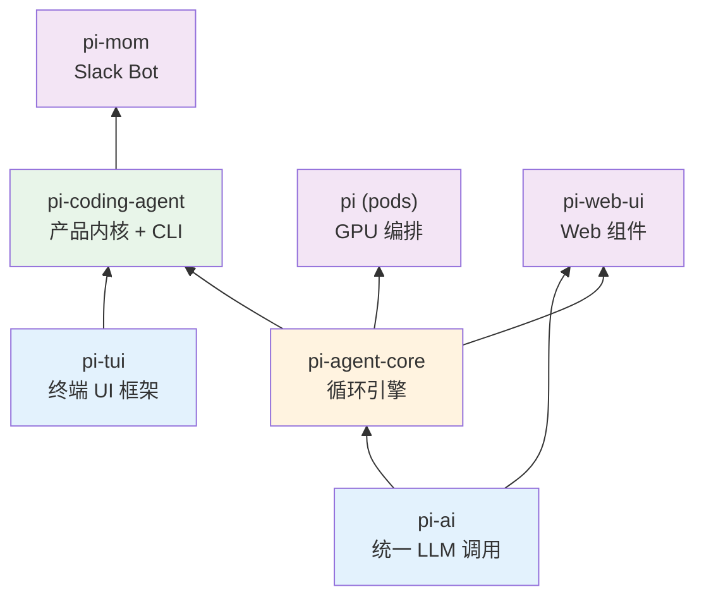
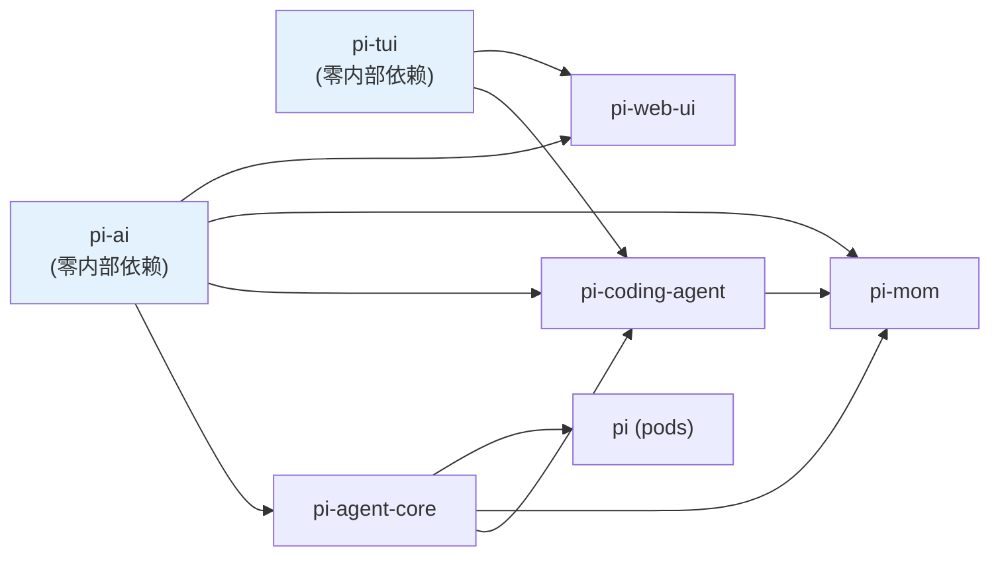

# 第 2 章：七个包不是七个项目

> **定位**：本章建立全书最重要的一张分层图。
> 前置依赖：第 1 章。
> 适用场景：当你想快速理解 pi-mono 的全局架构。

## 如何把一个庞大的 agent 系统切成互相不知道对方的层？

pi-mono 是一个 npm workspace monorepo，包含 7 个 npm 包。但它们不是"7 个独立项目" — 它们是一个系统的 7 层。

## Workspace 配置

先看根目录的 `package.json`，它定义了 monorepo 的边界：

```json
// file: package.json:4-11
{
  "workspaces": [
    "packages/*",
    "packages/web-ui/example",
    "packages/coding-agent/examples/extensions/with-deps",
    "packages/coding-agent/examples/extensions/custom-provider-anthropic",
    "packages/coding-agent/examples/extensions/custom-provider-gitlab-duo",
    "packages/coding-agent/examples/extensions/custom-provider-qwen-cli"
  ]
}
```

`packages/*` 覆盖了 7 个核心包。额外的 workspace 入口是 example 项目 — 它们是 extension 的示范实现，也需要参与 npm 的依赖解析，否则它们的 `node_modules` 不会被正确链接。

注意根 `package.json` 的 `"private": true` — 这个 monorepo 本身不发布，只有内部的 7 个包才发布到 npm。

## 分层图



依赖箭头只向上 — 底层的包不知道上层的存在。`pi-ai` 不知道 `pi-agent-core` 的存在，`pi-agent-core` 不知道 `pi-coding-agent` 的存在。

## 依赖关系的实际验证

每个包的 `package.json` 中的 `dependencies` 字段精确地记录了这些依赖关系。我们可以从源码中直接验证：

**pi-ai**（`@mariozechner/pi-ai`）：零内部依赖。它只依赖外部 SDK — `@anthropic-ai/sdk`、`openai`、`@google/genai`、`@mistralai/mistralai`、`@aws-sdk/client-bedrock-runtime` 等。这是整个系统的最底层。

**pi-agent-core**（`@mariozechner/pi-agent-core`）：唯一的内部依赖是 `pi-ai`。

```json
// file: packages/agent/package.json:19-21
{
  "dependencies": {
    "@mariozechner/pi-ai": "^0.66.0"
  }
}
```

极其克制 — 整个循环引擎只有一个内部依赖。

**pi-tui**（`@mariozechner/pi-tui`）：零内部依赖。它只依赖 `chalk`、`marked`、`get-east-asian-width` 等纯 UI 工具库。TUI 框架完全独立于 AI 系统。

**pi-coding-agent**（`@mariozechner/pi-coding-agent`）：依赖三个内部包。

```json
// file: packages/coding-agent/package.json:42-45
{
  "dependencies": {
    "@mariozechner/pi-agent-core": "^0.66.0",
    "@mariozechner/pi-ai": "^0.66.0",
    "@mariozechner/pi-tui": "^0.66.0"
  }
}
```

这是依赖最重的包 — 它是三个底层包的汇聚点，把 AI 调用、agent 循环和终端 UI 整合成一个编码助手产品。

**pi-mom**（`@mariozechner/pi-mom`）：依赖 `pi-ai`、`pi-agent-core` 和 `pi-coding-agent`。它复用了 coding agent 的全部能力，包装成 Slack bot 形态。

**pi (pods)**（`@mariozechner/pi`）：只依赖 `pi-agent-core`。它是 GPU pod 编排工具，需要 agent 能力但不需要 coding agent 的产品层逻辑。

**pi-web-ui**（`@mariozechner/pi-web-ui`）：在当前 `package.json` 的 direct dependencies 中只声明了 `pi-ai` 和 `pi-tui`。但从实现上看，`AgentInterface` 直接 import 了 `pi-agent-core` 的 `Agent` / `AgentEvent`，所以它在架构上仍然紧贴 core 层，只是这个耦合没有体现在当前 manifest 的 direct dependency 图里。

### 依赖关系图（按 direct dependencies 绘制）



这张图的关键特征：没有环。箭头严格从底层指向上层。这不是偶然的 — 它是设计约束。

需要单独说明的是：这张图只反映 `package.json` 里的 direct dependencies，不等于源码中的全部耦合关系。`pi-web-ui` 的实现代码仍直接面向 `pi-agent-core` 的 `Agent` / `AgentEvent`，所以在第 1 张分层图里把它画在 core 之上仍然是合理的。

## 包的规模与职责

| 包名 | npm 名 | 源文件数 | 源代码行数 | 主要 exports |
|------|--------|---------|-----------|-------------|
| pi-ai | `@mariozechner/pi-ai` | 43 | ~26,900 | `stream()`, Provider Registry, Model 类型 |
| pi-agent-core | `@mariozechner/pi-agent-core` | 5 | ~1,900 | `agentLoop()`, `Agent`, 类型定义 |
| pi-coding-agent | `@mariozechner/pi-coding-agent` | 129 | ~42,100 | CLI 入口, Session Manager, 工具集, Extension API |
| pi-tui | `@mariozechner/pi-tui` | 25 | ~10,800 | Terminal 渲染引擎, 编辑器组件 |
| pi-mom | `@mariozechner/pi-mom` | 16 | ~4,000 | Slack Bot 入口 |
| pi (pods) | `@mariozechner/pi` | 9 | ~1,800 | GPU pod CLI |
| pi-web-ui | `@mariozechner/pi-web-ui` | 71 | ~14,600 | Web Chat 组件, CSS |

几个值得关注的数字：

**pi-agent-core 只有 5 个源文件、~1,900 行代码**。这是整个 agent 系统的循环引擎。它的极简性不是偶然 — 循环引擎故意只做"循环"这一件事，把所有业务逻辑推给上层。

**pi-coding-agent 有 129 个源文件、~42,100 行代码**。它占了整个项目的近半数代码量。这也是符合预期的 — 产品层需要处理大量具体的工程问题：130+ 个工具实现、会话管理、prompt 组装、extension 加载、配置覆盖等。

**pi-ai 有 ~26,900 行代码**。这些代码的大部分是各 provider 的实现（Anthropic、OpenAI、Google、Bedrock、Mistral 等）和自动生成的模型目录。核心抽象（`api-registry.ts`）只有 98 行。

## 每个包的导出策略

pi-mono 中的包在 npm 发布时的导出策略各不相同，反映了它们面向不同使用者的设计意图。

**pi-ai 的多入口导出**。pi-ai 不仅导出主入口（`@mariozechner/pi-ai`），还为每个 provider 提供独立的子路径导出（`@mariozechner/pi-ai/anthropic`、`@mariozechner/pi-ai/openai-responses` 等）。这让使用者可以只导入需要的 provider，避免把所有 provider 的 SDK 都拉进依赖树。OAuth 支持也是独立子路径（`@mariozechner/pi-ai/oauth`）。

**pi-coding-agent 的 hooks 导出**。除了主入口，pi-coding-agent 还导出 `@mariozechner/pi-coding-agent/hooks` — 这是给 extension 开发者用的。Extension 需要引用 hooks 的类型定义，但不应该依赖整个 coding-agent 包的内部实现。单独的子路径导出实现了这种选择性暴露。

**pi-tui 和 pi-agent-core 的单入口导出**。这两个包只有一个导出入口，因为它们的 API 面足够小 — 没有需要独立拆分的子模块。

**bin 字段**。`pi-coding-agent` 导出 `pi` 命令（`"bin": { "pi": "dist/cli.js" }`），`pi-ai` 导出 `pi-ai` 命令，`pi-mom` 导出 `mom` 命令，`pods` 导出 `pi-pods` 命令。这些是面向终端用户的入口点。`pi-tui`、`pi-agent-core`、`pi-web-ui` 没有 bin — 它们是纯库，不提供 CLI。

## 构建顺序

npm workspace 不保证构建顺序。如果你运行 `npm run build`，npm 会并行构建所有包 — 但包之间有依赖关系，并行构建会失败。

pi-mono 通过在根 `package.json` 的 `build` 脚本中**手动编排构建顺序**来解决这个问题：

```json
// file: package.json:15
{
  "build": "cd packages/tui && npm run build && cd ../ai && npm run build && cd ../agent && npm run build && cd ../coding-agent && npm run build && cd ../mom && npm run build && cd ../web-ui && npm run build && cd ../pods && npm run build"
}
```

构建顺序是：`tui` → `ai` → `agent` → `coding-agent` → `mom` → `web-ui` → `pods`。

这个顺序必须满足一个约束：**每个包在构建时，它所依赖的包必须已经构建完成**。让我们验证：

1. `tui`：零内部依赖，可以最先构建
2. `ai`：零内部依赖，可以最先构建（与 tui 并行也可以）
3. `agent`：依赖 `ai`，必须在 `ai` 之后
4. `coding-agent`：依赖 `ai` + `agent` + `tui`，必须在三者之后
5. `mom`：依赖 `coding-agent`，必须在其之后
6. `web-ui`：依赖 `ai` + `agent` + `tui`，必须在三者之后
7. `pods`：依赖 `agent`，理论上可以在 `agent` 之后就开始

当前的串行构建没有做并行优化 — `web-ui` 和 `pods` 可以更早开始。但对于一个内部项目来说，串行构建的简单性和可调试性比省几秒构建时间更有价值。

注意 `pi-ai` 的构建有一个特殊步骤：

```json
// file: packages/ai/package.json:67
{
  "build": "npm run generate-models && tsgo -p tsconfig.build.json"
}
```

构建前先运行 `generate-models` — 这个脚本从各 provider 的 API 拉取最新的模型目录，生成 `models.generated.ts`（第 18 章详述）。这意味着每次完整构建都会拿到最新的模型列表。

## Lockstep 版本

所有 7 个包始终使用同一个版本号（当前 v0.66.0）。每次发布，全部包一起升版。

**得到了什么**：永远不会有"pi-ai v0.65 和 pi-agent-core v0.66 不兼容"的问题。开发者看到一个版本号就知道整个系统的状态。CI/CD 流程简单 — 一个脚本升版、一个脚本发布。

**放弃了什么**：一个只影响 `pi-tui` 的 bug fix 也要升全部 7 个包。但对于一个内部高度耦合的系统，lockstep 的简单性远胜于独立版本的灵活性。

版本管理通过根目录的脚本完成：

```json
// file: package.json:23-25
{
  "version:patch": "npm version patch -ws --no-git-tag-version && node scripts/sync-versions.js && ...",
  "version:minor": "npm version minor -ws --no-git-tag-version && node scripts/sync-versions.js && ..."
}
```

`npm version patch -ws` 同时升所有 workspace 的版本，`sync-versions.js` 确保交叉依赖中的版本号也同步更新（比如 `pi-agent-core` 的 `dependencies` 中引用的 `@mariozechner/pi-ai` 版本号）。

## 为什么是 7 个包而不是 3 个或 15 个

包的数量不是随意的。pi-mono 的包划分遵循一个原则：**当且仅当两段代码有不同的使用者时，它们才应该在不同的包中**。

`pi-ai` 单独成包，因为有人只想用统一 LLM 调用而不需要 agent 循环。`pi-tui` 单独成包，因为终端 UI 框架与 AI 无关 — 它甚至可以用于非 AI 的 TUI 应用。`pi-agent-core` 单独成包，因为有人想用循环引擎构建非编码类 agent（比如 pods 的 GPU 编排 agent）。

反过来，`pi-coding-agent` 没有被进一步拆分为 "工具包"、"session 包"、"prompt 包"，因为这些部分没有独立的使用者 — 没有人只要 pi 的工具系统而不要 session 管理。过度拆分只会增加包之间的版本协调成本而没有实际收益。

初期 pi-mono 只有 3 个包（ai、agent、tui）。随着 Slack bot、GPU 编排、Web UI 等产品形态的出现，包的数量逐渐增长到 7 个。但每次添加新包的决策标准是一致的：这段代码是否有独立的使用者。

## 取舍分析

### 得到了什么

**强制的分层纪律**。npm 包是硬边界 — 如果 `pi-ai` 试图 import `pi-agent-core` 的代码，TypeScript 编译器会直接报错。这比"团队约定不要跨层调用"强得多。

**独立测试**。每个包有自己的 `vitest` 测试。测试 `pi-agent-core` 时不需要启动任何 UI，测试 `pi-tui` 时不需要配置 API key。

**渐进式采用**。外部开发者可以只使用 `pi-ai`（统一 LLM 调用），不需要引入 agent 引擎；也可以使用 `pi-agent-core`（循环引擎）来构建自己的 agent，不需要依赖 coding agent 的产品层逻辑。

### 放弃了什么

**开发环境复杂度**。7 个包意味着 7 个 `tsconfig.json`、7 个构建流程。`dev` 脚本需要用 `concurrently` 同时启动 6 个包的 watch 模式。新贡献者需要理解 monorepo 的工作方式。

**发布流程的原子性要求**。lockstep 版本意味着每次发布必须全部成功或全部回滚。如果 `pi-mom` 的发布失败了，已经发布成功的 `pi-ai` 也需要处理（虽然实际上各包独立发布到 npm，部分失败时版本号已经消耗掉了）。

---

### 版本演化说明
> 本章核心分析基于 pi-mono v0.66.0。包的数量从最初的 3 个（ai、agent、tui）
> 增长到了 7 个，但分层原则和 lockstep 版本策略从未改变。
