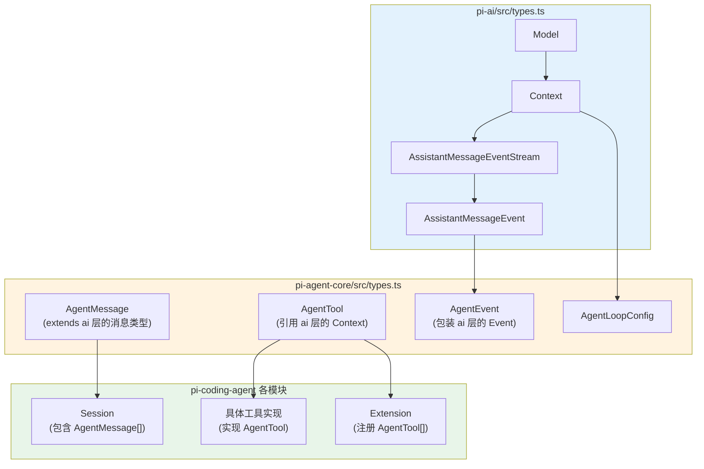

# 第 3 章：怎样高效阅读这个仓库

> **定位**：本章告诉读者怎样高效读码，避免迷失在细节中。
> 前置依赖：第 2 章。
> 适用场景：当你打算直接看源码。

## 先读的 10 个文件

| 优先级 | 文件 | 理由 |
|--------|------|------|
| 1 | `packages/agent/src/types.ts` | 定义了 Agent 系统的全部类型 |
| 2 | `packages/ai/src/api-registry.ts` | 98 行，极简的 provider 注册 |
| 3 | `packages/agent/src/agent-loop.ts` | 循环引擎核心 |
| 4 | `packages/agent/src/agent.ts` | 有状态壳 |
| 5 | `packages/ai/src/stream.ts` | 公共 API 入口 |
| 6 | `packages/ai/src/types.ts` | Model、Context、Event 定义 |
| 7 | `packages/coding-agent/src/core/session-manager.ts` | 会话树 |
| 8 | `packages/coding-agent/src/core/system-prompt.ts` | Prompt 装配 |
| 9 | `packages/coding-agent/src/core/tools/edit.ts` | 工具设计范例 |
| 10 | `packages/coding-agent/src/core/extensions/types.ts` | Extension API 面 |

### 每个文件你会看到什么

**1. `packages/agent/src/types.ts`** — 这是整个 agent 系统的 "schema"。你会在这里找到 `AgentMessage`（所有消息类型的联合）、`AgentTool`（工具的定义接口）、`AgentEvent`（循环引擎产出的事件流）和 `AgentLoopConfig`（循环的配置项）。理解这些类型后，你看任何其他文件都能立刻知道数据流的形状。这个文件不长，但信息密度极高 — 建议逐行读完。

**2. `packages/ai/src/api-registry.ts`** — 只有 98 行的 provider 注册表。你会看到 `registerApiProvider` 函数和 `getApiProvider` 函数 — 前者把一个 provider 名称和一个流式调用函数绑定在一起，后者根据名称取出对应的调用函数。整个系统的 LLM 调用多态性就建立在这 98 行之上。读完它你会理解为什么添加一个新 provider 如此简单。

**3. `packages/agent/src/agent-loop.ts`** — 循环引擎的完整实现。你会看到一个 `while(true)` 循环，里面的逻辑是：调用 LLM → 收集事件 → 如果有 tool call 就执行 → 把 tool result 放回消息列表 → 继续循环。关键点是：这个函数是**纯函数式**的 — 它的所有输入（消息、工具、配置）都从参数传入，所有输出都通过事件流返回。第 8 章会详细分析这个设计。

**4. `packages/agent/src/agent.ts`** — agentLoop 的有状态包装器。你会看到 `Agent` 类持有消息历史、工具列表、abort controller 等状态，然后在内部调用 agentLoop。它的存在回答了一个问题：如果循环引擎是无状态的，状态保存在哪里？答案是这个薄壳。它是 "stateful convenience layer"。

**5. `packages/ai/src/stream.ts`** — pi-ai 层的公共 API 入口。你会看到 `stream` 函数 — 给定一个 model 和 context，返回一个 `AssistantMessageEventStream`。这是整个系统中离 "调用 LLM" 最近的接口。它的实现很简单：从 api-registry 取出对应的 provider 函数，然后调用它。简单是因为复杂性被推到了各个 provider 的实现中。

**6. `packages/ai/src/types.ts`** — pi-ai 层的类型系统。你会找到 `Model` 类型（一个模型的完整元数据：id、provider、cost、context window 等）、`Context` 类型（发送给 LLM 的完整上下文：messages、tools、system prompt 等）和各种事件类型。这些类型定义了 pi-ai 层的 "公共 API 契约" — 上层代码（agent-core）只通过这些类型与 ai 层交互。

**7. `packages/coding-agent/src/core/session-manager.ts`** — 会话的持久化和分支管理。你会看到会话如何被序列化到磁盘（JSON 文件）、如何创建分支（fork）、如何回退到历史节点。这是让 pi 的对话可以"时间旅行"的关键机制。如果你想理解 pi 的交互模型为什么比简单的聊天框更强大，这是入口。

**8. `packages/coding-agent/src/core/system-prompt.ts`** — Prompt 装配的完整逻辑。你会看到 system prompt 是如何从多个来源（基础模板、AGENTS.md 文件、用户自定义、extension 注入）层层拼装的。理解这个文件的关键在于：system prompt 不是一个静态字符串，而是一个运行时动态组装的产物。这解释了为什么 pi 可以根据项目上下文、用户配置、已加载的 skill 动态调整 agent 的行为。

**9. `packages/coding-agent/src/core/tools/edit.ts`** — 文件编辑工具的实现。你会看到一个完整的工具定义：tool schema（告诉 LLM 这个工具接受什么参数）、执行逻辑（实际操作文件系统）、结果格式（返回什么给 LLM）。这是理解 "pi 的工具是怎么设计的" 最好的范例 — 不是因为它最复杂，而是因为它最能代表设计模式。读完一个工具，你就知道其他所有工具的结构。

**10. `packages/coding-agent/src/core/extensions/types.ts`** — Extension API 的完整类型定义。你会看到 Extension 可以做什么：注册新工具（tools）、注册新 slash command（commands）、注册新 API provider（apiProviders）、提供 skill 和 prompt 路径。这个文件定义了 pi 的**可扩展性边界** — Extension 能做什么、不能做什么，全由这些类型决定。

## 最后读的 10 个文件

| 文件 | 理由 |
|------|------|
| `packages/tui/src/components/editor.ts` | 交互细节，不是设计核心 |
| `packages/coding-agent/src/modes/interactive/components/*.ts` | 35+ UI 组件，按需查看 |
| `packages/ai/src/providers/anthropic.ts` 等 | 具体 provider 实现 |
| `packages/coding-agent/src/core/slash-commands.ts` | 命令列表，不是设计 |
| `packages/coding-agent/src/modes/interactive/theme/theme.ts` | UI 主题 |
| `packages/ai/src/models.generated.ts` | 自动生成的模型目录 |
| `packages/coding-agent/src/core/export-html/` | HTML 导出，工程实现 |
| `packages/tui/src/components/list.ts` | 列表组件渲染，UI 细节 |
| `packages/web-ui/src/components/` | Web 组件，另一种 UI 实现 |
| `packages/mom/src/slack/` | Slack API 对接，平台细节 |

这些文件不是不重要 — 它们只是不应该**先**读。它们是"设计的消费者"，不是"设计本身"。

## 类型如何串连整个系统

pi 的设计中，类型不仅是编译器检查的工具，更是**跨层通信的契约**。理解类型的依赖链，就理解了系统的数据流。

### 类型依赖链

从图中可以看到三个关键的类型边界：

**pi-ai → pi-agent-core**：agent-core 的 `AgentMessage` 扩展了 ai 层的消息类型（加入了 tool result 等）。`AgentEvent` 包装了 ai 层的 `AssistantMessageEvent`（加入了 tool 执行事件）。这意味着 agent-core 的事件流是 ai 层事件流的超集。

**pi-agent-core → pi-coding-agent**：coding-agent 的 `Session` 持有 `AgentMessage[]` — 会话的本质就是一个消息数组。具体的工具（edit、bash、read 等）实现 `AgentTool` 接口。Extension 向系统注册新的 `AgentTool[]`。

**泛型传递**：`Model<TApi>` 的泛型参数 `TApi` 一路传递到 `Context<TApi>`，再到 `Stream`。这确保了类型安全 — 如果你用 Anthropic 的 model，context 里只能放 Anthropic 支持的参数。这个泛型链在编译时就阻止了 "把 OpenAI 的参数传给 Anthropic provider" 这类错误。

### 跟着一个类型读代码的例子

假设你想理解 "工具调用的结果是怎么流回 LLM 的"。可以这样跟踪：

1. 在 `agent/src/types.ts` 中找到 `AgentTool` — 它的 `execute` 方法返回 `ToolResult`
2. 在 `agent/src/agent-loop.ts` 中搜索 `ToolResult` — 你会看到循环引擎把 tool result 包装成 `ToolResultMessage` 并加入消息列表
3. 在 `ai/src/types.ts` 中找到 `ToolResultMessage` — 它是 `Context.messages` 数组中合法的消息类型之一
4. 在 `ai/src/providers/anthropic.ts` 中搜索 `ToolResultMessage` — 你会看到它被转换成 Anthropic API 要求的 `tool_result` content block

整个链路：`工具执行 → ToolResult → ToolResultMessage → 消息列表 → Provider 转换 → API 请求`。每一步都有对应的类型。

## 阅读策略

**不要从 TUI 开始读**。TUI 组件有 35+ 个文件，大量的交互细节。它们是"上层消费者"，不是"设计核心"。先理解内核（第 1-6 项），再看 TUI 如何消费事件。

**不要从 provider 实现开始读**。`anthropic.ts`、`openai-responses.ts` 等文件是"api-registry 的用户"，不是设计本身。先理解注册表，再看具体实现。

**跟着类型走**。`agent/src/types.ts` 定义了 `AgentMessage`、`AgentEvent`、`AgentTool`、`AgentLoopConfig` — 这些类型串起了整个系统。从类型出发，看哪些函数使用它们。

**用搜索代替目录浏览**。pi-mono 有 298 个源文件。逐文件浏览效率极低。更好的策略是：找到一个你关心的类型或函数名，在整个仓库中搜索它的使用处。工具推荐：`grep -rn "AgentTool" packages/`。

## 常见阅读误区

在阅读 pi 源码时，有几个容易踩的坑：

### 误区 1：把 agentLoop 当作唯一入口

很多人一上来就找 `main` 函数或启动入口。pi 的启动路径是 `cli.ts` → `session-manager.ts` → `agent.ts` → `agent-loop.ts`，但**理解系统不应该从启动路径开始**。启动路径包含大量初始化逻辑（参数解析、配置读取、资源加载），这些会分散你对核心设计的注意力。

正确做法：先读 `agent-loop.ts` 理解循环引擎，再倒推它的调用者是谁。

### 误区 2：试图理解所有 provider 实现

pi-ai 支持 10+ 个 provider（Anthropic、OpenAI Responses、OpenAI Completions、Google、Bedrock、Mistral、Azure、Copilot、OpenRouter、Vercel Gateway 等）。每个 provider 有不同的 API 格式和特殊处理。

如果你试图读完所有 provider 再理解系统，你会花很长时间且收获不大。正确做法：只读 `anthropic.ts`（最简洁的实现），理解 provider 的接口契约后，其他 provider 按需查看。

### 误区 3：忽略 `models.generated.ts`

这个文件有上万行，是自动生成的模型目录。很多人看到它会直接跳过。但它的存在本身就是一个设计决策：pi 为什么选择在构建时生成模型目录，而不是运行时从 API 查询？（答案：离线可用 + 启动速度。第 18 章详述。）

正确做法：不需要读它的内容（确实是机器生成的），但需要理解它为什么存在、怎么生成。

### 误区 4：把 Extension 和 Skill 混为一谈

Extension 是**代码模块**（TypeScript/JavaScript），可以注册新工具、新 provider。Skill 是**指令文档**（Markdown），只能被注入到 system prompt 中。两者的能力边界完全不同。

很多人看到 "Extension 可以提供 skill 路径" 就以为 Extension 包含 Skill。准确的关系是：Extension 可以**注册额外的 Skill 加载路径**，但 Extension 本身和 Skill 是两种独立的资源类型。

### 误区 5：低估 types.ts 的重要性

agent/src/types.ts 只有几百行，看起来"没什么内容"。但这个文件是整个 agent 系统的骨架。每个类型的每个字段都对应着一个设计决策。比如 `AgentTool` 中的 `isReadOnly` 字段 — 为什么需要区分只读和写入工具？因为它影响了工具是否可以并行执行（第 22 章详述）。

正确做法：types.ts 至少读两遍。第一遍建立整体印象，读完几章设计分析后再回来读第二遍 — 你会发现每个字段都有了具体的含义。

---

### 版本演化说明
> 本章文件列表基于 pi-mono v0.66.0 的目录结构。
> 文件路径可能随版本变化，但"先读内核、后读产品层"的策略不变。
