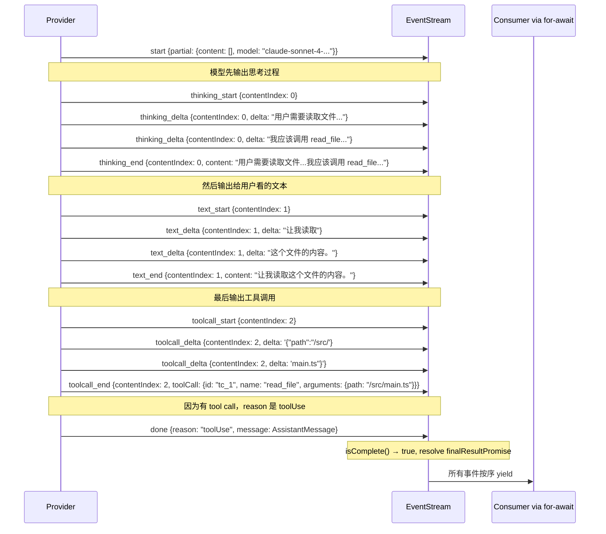

# 第 6 章：统一事件流设计

> **定位**：本章解析 pi-ai 的流式事件契约 — 整个系统的"最底层脉搏"。
> 前置依赖：第 4 章（Provider Registry）。
> 适用场景：当你想理解为什么 pi 选择流式事件而非一次性响应，或者想为自己的系统设计流式 API。

## 为什么不返回一个 Promise，而是返回一个事件流？

这是本章的核心设计问题。

最简单的 LLM API 设计是 `async function complete(prompt): Promise<string>`。调用、等待、拿结果。但 pi 从最底层就选择了流式设计 — 即使是不需要流式渲染的场景（比如后台任务），底层 API 仍然返回事件流。

这个选择的原因不是"流式渲染更快"（虽然确实如此），而是**事件流是唯一能完整捕获 LLM 交互过程的数据模型**。一个 `Promise<string>` 能告诉你结果，但不能告诉你过程中发生了什么 — thinking 阶段用了多长时间、模型输出的每个 token 的时间分布、tool call 是在什么位置开始出现的。事件流把这些过程信息保留了下来。

## `StreamFunction` 的契约

pi-ai 层最重要的一段注释在 `types.ts` 的 `StreamFunction` 类型定义上：

```typescript
// packages/ai/src/types.ts:117-129

// Contract:
// - Must return an AssistantMessageEventStream.
// - Once invoked, request/model/runtime failures should be encoded in the
//   returned stream, not thrown.
// - Error termination must produce an AssistantMessage with stopReason
//   "error" or "aborted" and errorMessage, emitted via the stream protocol.
export type StreamFunction<TApi extends Api, TOptions extends StreamOptions> = (
  model: Model<TApi>,
  context: Context,
  options?: TOptions,
) => AssistantMessageEventStream;
```

这三条规则定义了整个系统的错误处理哲学：

**规则 1：必须返回事件流**。不是 Promise，不是回调，是 `AssistantMessageEventStream`。调用者总是拿到一个流对象，然后 `for await` 消费事件。

**规则 2：一旦调用，错误编码进流里**。`StreamFunction` 本身不抛异常。网络超时、API 限流、模型不存在 — 所有失败都通过流中的事件传递。这意味着调用者不需要 try-catch。

**规则 3：错误终止必须产出完整的 `AssistantMessage`**。即使请求失败了，流也必须产出一个带 `stopReason: "error"` 和 `errorMessage` 的 `AssistantMessage`。调用者总是可以调 `stream.result()` 拿到一个消息对象 — 成功的或失败的。

## `EventStream`：发布-消费的桥梁

`AssistantMessageEventStream` 的底层实现是一个通用的 `EventStream<T, R>` 类。这个类只有 66 行，却是整个流式架构的基石。我们完整地展示它，然后逐段分析。

### 完整实现

```typescript
// packages/ai/src/utils/event-stream.ts:4-66

export class EventStream<T, R = T> implements AsyncIterable<T> {
  private queue: T[] = [];
  private waiting: ((value: IteratorResult<T>) => void)[] = [];
  private done = false;
  private finalResultPromise: Promise<R>;
  private resolveFinalResult!: (result: R) => void;

  constructor(
    private isComplete: (event: T) => boolean,
    private extractResult: (event: T) => R,
  ) {
    this.finalResultPromise = new Promise((resolve) => {
      this.resolveFinalResult = resolve;
    });
  }

  push(event: T): void {
    if (this.done) return;
    if (this.isComplete(event)) {
      this.done = true;
      this.resolveFinalResult(this.extractResult(event));
    }
    const waiter = this.waiting.shift();
    if (waiter) {
      waiter({ value: event, done: false });
    } else {
      this.queue.push(event);
    }
  }

  end(result?: R): void {
    this.done = true;
    if (result !== undefined) {
      this.resolveFinalResult(result);
    }
    while (this.waiting.length > 0) {
      const waiter = this.waiting.shift()!;
      waiter({ value: undefined as any, done: true });
    }
  }
```

```typescript
// packages/ai/src/utils/event-stream.ts:49-66

  async *[Symbol.asyncIterator](): AsyncIterator<T> {
    while (true) {
      if (this.queue.length > 0) {
        yield this.queue.shift()!;
      } else if (this.done) {
        return;
      } else {
        const result = await new Promise<IteratorResult<T>>(
          (resolve) => this.waiting.push(resolve)
        );
        if (result.done) return;
        yield result.value;
      }
    }
  }

  result(): Promise<R> {
    return this.finalResultPromise;
  }
}
```

### Queue/Waiting Consumer 模式

`EventStream` 的核心是一对互补的数组：`queue` 和 `waiting`。这个设计实现了生产者和消费者之间的无锁协调：

- `queue: T[]` — 事件缓冲区。当事件到达但没有消费者在等待时，事件排队等候。
- `waiting: ((value: IteratorResult<T>) => void)[]` — 消费者等待队列。当消费者需要下一个事件但队列为空时，消费者把自己的 resolve 函数注册到这里。

这两个数组**互斥**使用：在任何时刻，要么 `queue` 里有积压的事件（消费者慢于生产者），要么 `waiting` 里有挂起的消费者（消费者快于生产者），要么两个都为空（恰好平衡）。不可能同时两个数组都有内容 — 如果有积压的事件，新来的消费者会立即拿走一个；如果有等待的消费者，新来的事件会立即送达。

这个模式本质上是一个**无界异步通道**（unbounded async channel），但用不到 50 行代码实现了。没有引入任何第三方依赖，没有用 `EventEmitter`，没有用 `ReadableStream` — 就是两个数组和 Promise 的组合。

### `push()` 的工作流

```
push(event) 被调用
  │
  ├── done 为 true？→ 静默丢弃，直接返回
  │
  ├── isComplete(event) 为 true？
  │     → 标记 done = true
  │     → 用 extractResult(event) resolve finalResultPromise
  │
  └── 尝试投递事件
        ├── waiting 中有消费者？→ 取出第一个 waiter，直接投递
        └── 没有消费者？→ 推入 queue 缓冲
```

注意 `push()` 的一个关键设计：**即使事件触发了完成（`isComplete` 返回 true），该事件仍然会被投递给消费者**。设置 `done = true` 和 resolve `finalResultPromise` 发生在投递之前，但投递本身不会被跳过。这意味着消费者通过 `for await` 迭代时，一定能收到 `done` 或 `error` 这个终止事件本身 — 它不会被"吞掉"。

### `end()` 的工作流

`end()` 是为异常情况准备的"紧急关闭"方法：

```
end(result?) 被调用
  │
  ├── 标记 done = true
  │
  ├── result 不为 undefined？→ resolve finalResultPromise
  │
  └── 通知所有等待的消费者：发送 { done: true }
        → 每个 waiter 收到后，asyncIterator 中的循环 return
```

`end()` 和 `push()` 触发完成的区别在于：`push()` 是通过一个"完成事件"自然结束（流的正常终止路径），而 `end()` 是外部强制关闭流（比如 provider 代码捕获到异常后需要清理）。两者都会 resolve `finalResultPromise`，但 `end()` 不投递任何事件 — 它只是告诉所有等待中的消费者"没有更多数据了"。

### `result()` 和 `finalResultPromise`

`result()` 方法返回 `finalResultPromise` — 一个在构造时就创建好的 Promise。这个 Promise 在两种情况下被 resolve：

1. `push()` 收到一个使 `isComplete()` 返回 true 的事件时，用 `extractResult(event)` 的返回值 resolve。
2. `end(result)` 被显式传入 result 时，用这个 result 直接 resolve。

`result()` 的存在使得**流式消费和一次性消费使用同一个底层机制**。如果你需要流式渲染，`for await (const event of stream)` 逐个处理事件。如果你只需要最终结果，`await stream.result()` 直接等待。这就是 `completeSimple` 的实现方式：

```typescript
// 非流式用法：直接等最终结果
const message = await stream(model, context, options).result();
```

一行代码，把流式 API 变成了同步 API。消费者不需要知道底层是不是流式的 — 接口是统一的。

### `asyncIterator` 的三态循环

`[Symbol.asyncIterator]()` 是一个 async generator，它的 `while(true)` 循环在每次迭代中检查三种状态：

1. **`queue` 非空** — 直接 shift 一个事件 yield 出去。这是"追赶"模式：生产者曾经比消费者快，积累了缓冲，消费者现在快速消耗。
2. **`done` 为 true 且 `queue` 为空** — 流结束，return。不再产出任何值。
3. **`queue` 为空且 `done` 为 false** — 消费者比生产者快，没有事件可消费。创建一个 Promise 并把 resolve 函数推入 `waiting`。消费者挂起在这个 Promise 上，直到 `push()` 或 `end()` 来唤醒它。

这三态检查的顺序很重要：先检查 queue，再检查 done，最后挂起等待。这保证了即使流已经结束（`done` 为 true），消费者也会先把 queue 中的剩余事件消费完。

## `AssistantMessageEventStream`：具体化的 LLM 响应流

通用的 `EventStream<T, R>` 需要被具体化为 LLM 响应场景。这就是 `AssistantMessageEventStream` 的工作：

```typescript
// packages/ai/src/utils/event-stream.ts:68-82

export class AssistantMessageEventStream
  extends EventStream<AssistantMessageEvent, AssistantMessage> {
  constructor() {
    super(
      (event) => event.type === "done" || event.type === "error",
      (event) => {
        if (event.type === "done") {
          return event.message;
        } else if (event.type === "error") {
          return event.error;
        }
        throw new Error("Unexpected event type for final result");
      },
    );
  }
}
```

它做了两件事：

1. **定义完成条件**：`isComplete` 检查事件是否为 `done` 或 `error` 类型。只有这两种事件标志着流的终止。
2. **定义结果提取**：`extractResult` 从 `done` 事件取 `event.message`，从 `error` 事件取 `event.error`。两者都是 `AssistantMessage` 类型 — 成功和失败返回的是同一种数据结构，只是 `stopReason` 字段不同。

## 事件类型：`AssistantMessageEvent` 联合类型

`AssistantMessageEvent` 是一个 discriminated union，通过 `type` 字段区分 12 种事件。我们按功能分组来看：

### 生命周期事件

```typescript
// packages/ai/src/types.ts:238
| { type: "start"; partial: AssistantMessage }
```

**`start`** — 流的第一个事件。provider 在开始接收 API 响应后立即发射。携带一个初始的 `partial` AssistantMessage，此时 content 数组通常为空，但 `model`、`provider`、`api` 等元数据已经填充。消费者可以用这个事件来显示"正在生成..."的状态。

### 文本内容事件

```typescript
// packages/ai/src/types.ts:239-241
| { type: "text_start"; contentIndex: number; partial: AssistantMessage }
| { type: "text_delta"; contentIndex: number; delta: string; partial: AssistantMessage }
| { type: "text_end"; contentIndex: number; content: string; partial: AssistantMessage }
```

**`text_start`** — 一段文本内容开始。`contentIndex` 指向 `AssistantMessage.content` 数组中的位置。

**`text_delta`** — 文本增量。`delta` 是新增的文本片段（通常是一个或几个 token）。这是流式渲染的核心事件 — TUI 收到 `text_delta` 后立即追加显示。

**`text_end`** — 一段文本结束。`content` 是这段文本的完整内容（所有 delta 的拼接结果）。消费者可以用它来做最终校验，而不需要自己累积 delta。

### Thinking 事件

```typescript
// packages/ai/src/types.ts:242-244
| { type: "thinking_start"; contentIndex: number; partial: AssistantMessage }
| { type: "thinking_delta"; contentIndex: number; delta: string; partial: AssistantMessage }
| { type: "thinking_end"; contentIndex: number; content: string; partial: AssistantMessage }
```

**`thinking_start/delta/end`** — 与文本事件结构完全相同，但语义不同。这些事件对应模型的 extended thinking 输出（如 Claude 的 thinking blocks）。消费者可以选择性地显示或隐藏 thinking 内容。版本演化说明：这组事件是后来添加的，最初的设计只有 text 和 toolcall。

### Tool Call 事件

```typescript
// packages/ai/src/types.ts:245-247
| { type: "toolcall_start"; contentIndex: number; partial: AssistantMessage }
| { type: "toolcall_delta"; contentIndex: number; delta: string; partial: AssistantMessage }
| { type: "toolcall_end"; contentIndex: number; toolCall: ToolCall; partial: AssistantMessage }
```

**`toolcall_start`** — 模型开始生成一个 tool call。此时工具名称可能已经确定，但参数还在流式生成中。

**`toolcall_delta`** — 工具调用参数的增量。`delta` 是 JSON 参数字符串的一部分。与 text_delta 不同，tool call 的 delta 通常是不可直接渲染的 JSON 片段。

**`toolcall_end`** — 工具调用完成。`toolCall` 字段携带完整的 `ToolCall` 对象，包含 `id`、`name`、`arguments`。这是循环引擎（第 8 章）真正需要的事件 — 拿到完整的 tool call 后，引擎可以开始执行工具。

### 终止事件

```typescript
// packages/ai/src/types.ts:248-249
| { type: "done"; reason: "stop" | "length" | "toolUse"; message: AssistantMessage }
| { type: "error"; reason: "error" | "aborted"; error: AssistantMessage }
```

终止事件是整个事件协议中最关键的部分。它分为两种：

**`done`** — 正常终止。`reason` 告诉消费者**为什么**流结束了：
- `"stop"` — 模型自然结束输出。最常见的情况，表示模型认为回答已经完整。
- `"length"` — 达到 max tokens 限制，输出被截断。这不是错误，但消费者应该知道回答可能不完整。
- `"toolUse"` — 模型决定调用工具。注意这里是 `"toolUse"` 而不是 `"tool_use"` — pi 使用驼峰命名作为内部统一值，而不是照搬某个具体 provider 的命名。

**`error`** — 错误终止。`reason` 区分两种错误：
- `"error"` — 请求失败。网络超时、API 限流、模型返回错误响应等。
- `"aborted"` — 用户主动中止。通常是 AbortSignal 触发的取消操作。

两种终止事件都携带完整的 `AssistantMessage` 对象（`done.message` 和 `error.error`）。注意类型定义使用了 TypeScript 的 `Extract` 工具类型来约束 reason 的可选值 — `done` 只能携带 `"stop" | "length" | "toolUse"`，`error` 只能携带 `"error" | "aborted"`。这是编译时保证，不是运行时检查。

### `contentIndex` 和 `partial` 的设计意图

每个中间事件（除了 `start`、`done`、`error`）都携带两个公共字段：

- **`contentIndex: number`** — 指向 `AssistantMessage.content` 数组中的位置。一次 LLM 响应可能包含多个内容块（先 thinking，再 text，再 tool call），`contentIndex` 标识当前事件属于哪个块。
- **`partial: AssistantMessage`** — 到当前事件为止的累积状态。这个 partial 对象随着事件推进不断更新。消费者不需要自己维护状态 — 任何时候拿最新的 `partial` 就是当前的完整快照。

`partial` 的设计是一个有意的冗余。它增加了每个事件的数据量，但换来了消费者实现的极大简化。一个只关心最终文本的消费者，可以在收到任何事件时直接读取 `partial.content`，而不需要自己累积 delta。

## `AssistantMessage`：最终结果类型

无论流式消费还是一次性消费，最终拿到的都是 `AssistantMessage`：

```typescript
// packages/ai/src/types.ts:190-201

export interface AssistantMessage {
  role: "assistant";
  content: (TextContent | ThinkingContent | ToolCall)[];
  api: Api;
  provider: Provider;
  model: string;
  responseId?: string;
  usage: Usage;
  stopReason: StopReason;
  errorMessage?: string;
  timestamp: number; // Unix timestamp in milliseconds
}
```

逐字段分析：

- **`role: "assistant"`** — 固定值。与 `UserMessage`（`role: "user"`）和 `ToolResultMessage`（`role: "toolResult"`）一起构成三种消息类型，用于对话历史的类型区分。
- **`content: (TextContent | ThinkingContent | ToolCall)[]`** — 内容数组。一次响应可以包含多种类型的内容块：纯文本（`TextContent`）、思考过程（`ThinkingContent`）、工具调用（`ToolCall`）。数组的顺序对应模型输出的顺序。
- **`api: Api`** — 使用的 API 类型，如 `"anthropic-messages"` 或 `"openai-responses"`。
- **`provider: Provider`** — 使用的 provider，如 `"anthropic"` 或 `"openai"`。
- **`model: string`** — 实际使用的模型名称，如 `"claude-sonnet-4-20250514"`。
- **`responseId?: string`** — 上游 API 返回的响应标识符（可选）。不同 provider 的含义不同。
- **`usage: Usage`** — token 使用统计，包含 `input`、`output`、`cacheRead`、`cacheWrite`、`totalTokens`，以及对应的 `cost` 计算。
- **`stopReason: StopReason`** — 停止原因。类型为 `"stop" | "length" | "toolUse" | "error" | "aborted"`，与终止事件的 reason 对应。
- **`errorMessage?: string`** — 当 `stopReason` 为 `"error"` 或 `"aborted"` 时，携带错误描述。
- **`timestamp: number`** — Unix 时间戳（毫秒）。

`Usage` 类型值得单独展开：

```typescript
// packages/ai/src/types.ts:167-180

export interface Usage {
  input: number;
  output: number;
  cacheRead: number;
  cacheWrite: number;
  totalTokens: number;
  cost: {
    input: number;
    output: number;
    cacheRead: number;
    cacheWrite: number;
    total: number;
  };
}
```

`Usage` 同时记录 token 数量和费用。`cacheRead` 和 `cacheWrite` 是 prompt caching 相关的统计 — 不是所有 provider 都支持，不支持的填 0。`cost` 嵌套对象把 token 数量按各 provider 的价格转换成了美元金额，让上层不需要知道定价细节。

## 一次典型 LLM 响应的事件序列

理论分析完了，让我们看一个具体的场景：用户要求 coding agent 读取一个文件。模型决定调用 `read_file` 工具，同时输出一段说明文本。整个过程产生的事件序列如下：



关键观察：

1. **`contentIndex` 递增**：thinking 是 0，text 是 1，tool call 是 2。这个数字对应最终 `AssistantMessage.content` 数组的下标。
2. **每个内容块都有完整的 start/delta/end 周期**。消费者可以用 `_start` 和 `_end` 作为状态机的转换边界。
3. **`done` 的 reason 是 `"toolUse"`**，不是 `"stop"`。因为模型输出了 tool call，循环引擎（第 8 章）收到这个 reason 后知道需要执行工具并继续循环。
4. **每个中间事件都携带 `partial`**。如果消费者在收到第二个 `text_delta` 后崩溃了，重启后只需要看最后一个 `partial` 就知道完整状态。

对比另一个场景 — 纯文本回答（没有 tool call）：

事件序列会简单得多：`start` → `text_start` → 多个 `text_delta` → `text_end` → `done {reason: "stop"}`。没有 thinking（如果模型不支持或未启用 extended thinking），没有 tool call，`contentIndex` 始终为 0。

再对比一个错误场景 — API 限流：

`start` → `error {reason: "error", error: AssistantMessage{stopReason: "error", errorMessage: "Rate limited: retry after 30s"}}`。流可能只有两个事件就结束了。但消费者的处理逻辑不需要特殊化 — `for await` 正常迭代，`stream.result()` 正常返回一个 `AssistantMessage`，只是 `stopReason` 是 `"error"`。

## 取舍分析

### 得到了什么

**1. 会话录制和回放**。因为所有交互都是事件流，只需序列化事件就能录制完整的会话过程。回放时重放事件，不需要重新调用 LLM。

**2. 统一的错误处理路径**。成功和失败走同一条路 — 都是事件流里的事件。调用者不需要两套处理逻辑（try-catch + event handler）。

**3. 消费者解耦**。生产者（provider）和消费者（循环引擎、TUI、session manager）通过事件流解耦。provider 不知道谁在消费事件，消费者不知道事件来自哪个 provider。

**4. 流式和非流式的统一**。`stream.result()` 让不关心过程的调用者用一行代码拿到最终结果。底层机制完全相同，不需要维护两套 API。

**5. 渐进式消费**。`partial` 字段让消费者可以在任何时刻获取当前的完整快照，而不需要自己维护累积状态。这大幅简化了 TUI 渲染逻辑。

### 放弃了什么

**1. 每个消费者都要写状态机**。消费事件流比消费 `Promise<string>` 复杂得多。消费者需要跟踪 `start`/`delta`/`end` 状态，处理部分消息的累积。这是流式设计的固有复杂性。（`partial` 字段在一定程度上缓解了这个问题，但消费者仍然需要理解事件协议。）

**2. 调试更困难**。事件流的执行过程是异步的、交错的。当出问题时，需要查看完整的事件序列才能定位原因，比查看一个同步的函数调用栈要困难。

**3. "Must not throw"契约需要每个 provider 遵守**。如果某个 provider 的实现不小心抛了异常而没有编码进事件流，调用者的 `for await` 会收到一个意外的 rejection，整个调用链可能崩溃。这个契约是信任性的，没有编译时强制。

**4. `partial` 的内存开销**。每个中间事件都携带完整的 `partial` AssistantMessage 快照。对于一个长回答，可能有数百个 delta 事件，每个都带一份完整快照。这是用内存换取消费者的简单性。

---

### 版本演化说明
> 本章核心分析基于 pi-mono v0.66.0。事件流设计自 pi-ai 创建以来是最稳定的部分。
> `EventStream` 类的实现几乎没有改变。事件类型随 provider 能力的增加而扩展
> （比如 `thinking_start/delta/end` 是后来为支持 extended thinking 而添加的）。
