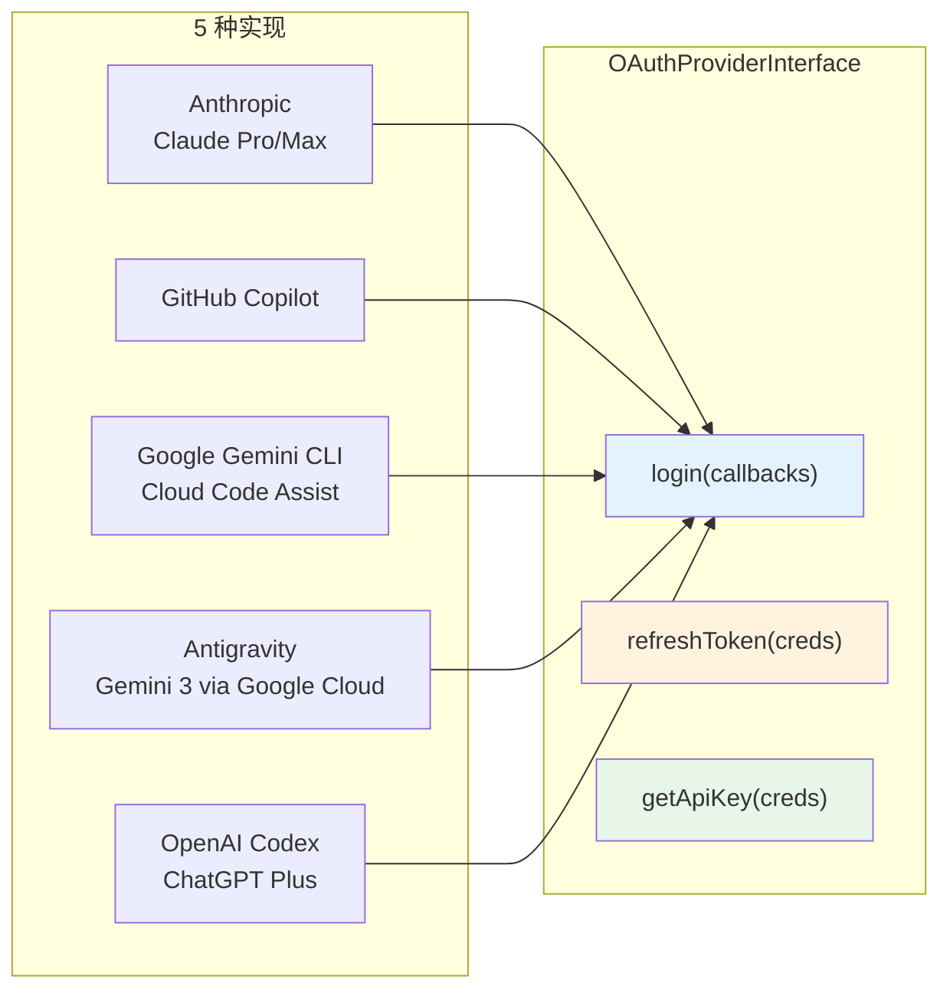
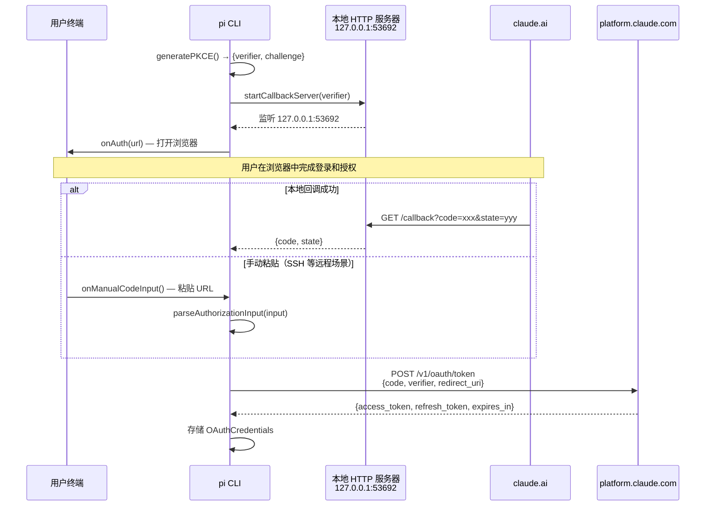

# 第 7 章：OAuth — 统一认证的隐藏复杂度

> **定位**：本章解析为什么一个 LLM 抽象层还要管认证，以及 5 种 OAuth 流程如何被统一。
> 前置依赖：第 4 章（Provider Registry）。
> 适用场景：当你想理解为什么认证不能推到产品层，或者想为 pi 添加新的 OAuth provider。

## 为什么 LLM 抽象层要管认证？

这是本章的核心设计问题。

直觉上，认证应该是产品层的事 — 用户登录，拿到 token，传给 LLM 调用层。但 pi 把 OAuth 管理放在了 pi-ai 层，和 provider 注册、事件流并列。

原因是一个实际问题：**OAuth token 会过期，而 agent 的一次 run 可能持续几十分钟。**

一个 coding agent 的典型工作流：用户提问 → agent 思考 → 执行 bash 命令（3 分钟）→ 读文件 → 编辑文件 → 再思考 → 再执行命令... 一次 run 可能包含十几次 LLM 调用，跨越几十分钟。如果 OAuth token 在第 7 次调用时过期了，谁负责刷新？

如果认证在产品层，产品层需要在每次 LLM 调用前检查 token 有效性并刷新。但产品层不知道什么时候会发生 LLM 调用 — 那是循环引擎决定的。把 token 刷新放在 ai 层，在 `getApiKey` 回调中透明地处理，循环引擎不需要知道 token 刷新的存在。

这就是第 8 章介绍的 `AgentLoopConfig.getApiKey` 回调的设计理由。

## 5 种 OAuth 流程的统一

pi-ai 的 OAuth 模块位于 `packages/ai/src/utils/oauth/`，支持 5 种 provider：



每种 provider 的 OAuth 流程差异巨大：Anthropic 用标准 PKCE 流程，GitHub Copilot 用 device code 流程，Google 系列用 Google Cloud OAuth + 本地回调服务器，OpenAI Codex 用 ChatGPT 的 session token。但对外暴露的接口是统一的。

### `OAuthProviderInterface`：3 个核心方法统一一切

```typescript
// packages/ai/src/utils/oauth/types.ts:34-52

interface OAuthProviderInterface {
  readonly id: OAuthProviderId;
  readonly name: string;

  /** 执行登录流程，返回凭证 */
  login(callbacks: OAuthLoginCallbacks): Promise<OAuthCredentials>;

  /** 是否使用本地回调服务器（影响 UI 提示） */
  usesCallbackServer?: boolean;

  /** 刷新过期凭证 */
  refreshToken(credentials: OAuthCredentials): Promise<OAuthCredentials>;

  /** 从凭证中提取 API key */
  getApiKey(credentials: OAuthCredentials): string;

  /** 可选：修改模型列表（如更新 baseUrl） */
  modifyModels?(models: Model[], credentials: OAuthCredentials): Model[];
}
```

设计要点：

**`login` 通过回调与 UI 交互**。`OAuthLoginCallbacks` 提供了 `onAuth`（显示授权 URL）、`onPrompt`（请求用户输入）、`onProgress`（显示进度）、`onManualCodeInput`（手动输入授权码）。OAuth provider 不知道自己在终端还是浏览器里 — 它只管调回调。

**`OAuthCredentials` 是通用的**。必须有 `refresh`（刷新 token）、`access`（访问 token）、`expires`（过期时间戳），其余字段自由扩展（`[key: string]: unknown`）。每个 provider 可以存储自己的额外数据。

**`modifyModels` 是可选的**。GitHub Copilot 用它来更新模型的 `baseUrl`（指向 Copilot 的代理服务器而非 OpenAI 的直连地址）。

### `OAuthLoginCallbacks`：UI 抽象的关键

`login` 方法需要和用户交互 — 打开浏览器、显示授权码、等待用户输入。但 OAuth provider 不应该知道自己运行在什么环境中。终端、Electron 窗口、Slack bot 的交互方式完全不同。`OAuthLoginCallbacks` 就是这层抽象：

```typescript
// packages/ai/src/utils/oauth/types.ts:26-32

export interface OAuthLoginCallbacks {
  onAuth: (info: OAuthAuthInfo) => void;
  onPrompt: (prompt: OAuthPrompt) => Promise<string>;
  onProgress?: (message: string) => void;
  onManualCodeInput?: () => Promise<string>;
  signal?: AbortSignal;
}
```

四个回调各有分工：

**`onAuth`** 是"请用户打开这个 URL 去授权"。参数包含 `url` 和可选的 `instructions`。终端实现会打印 URL 并尝试 `open` 命令打开浏览器；Slack bot 实现会发送一条包含链接的消息；Web UI 实现会弹出一个新窗口。OAuth provider 只管把 URL 传过去，不管怎么展示。

**`onPrompt`** 是"请用户输入一段文字"。参数包含 `message`（提示文字）、`placeholder`（占位符）、`allowEmpty`（是否允许空输入）。GitHub Copilot 的 device code 流程用它来询问 GitHub Enterprise 域名（留空表示 github.com）；Anthropic 用它在本地服务器接收失败时让用户手动粘贴授权码。

**`onProgress`** 是可选的进度通知。Anthropic 登录在交换 authorization code 时会调 `onProgress("Exchanging authorization code for tokens...")`；GitHub Copilot 登录在启用模型时会调 `onProgress("Enabling models...")`。终端可以显示 spinner，也可以忽略。

**`onManualCodeInput`** 是 PKCE 流程特有的降级路径。当 `usesCallbackServer` 为 `true` 时，login 流程同时启动本地 HTTP 服务器等待回调和手动输入。如果本地服务器无法接收回调（比如用户在远程 SSH 上运行 CLI，浏览器在另一台机器上），用户可以手动粘贴浏览器重定向后的 URL。这个回调让两条路径竞赛 — 哪个先拿到授权码就用哪个。

这个设计的关键洞察是：**OAuth 交互的本质是几个固定步骤（展示 URL、获取输入、报告进度），但展示方式因环境而异。** 把步骤和展示分离，一套 OAuth 逻辑就能在所有环境中复用。

## PKCE：为什么 CLI 应用不能有 client secret

传统 OAuth 依赖 client secret — 服务端应用在交换 authorization code 时带上 secret 证明身份。但 CLI 是发布到用户机器上的，任何人都能反编译出 secret。在 CLI 中硬编码 client secret 等于公开它。

PKCE（Proof Key for Code Exchange，RFC 7636）用一次性密码学证明替代了 client secret：

```typescript
// packages/ai/src/utils/oauth/pkce.ts:21-34

export async function generatePKCE(): Promise<{
  verifier: string; challenge: string
}> {
  // 生成 32 字节随机 verifier
  const verifierBytes = new Uint8Array(32);
  crypto.getRandomValues(verifierBytes);
  const verifier = base64urlEncode(verifierBytes);

  // 计算 SHA-256 challenge
  const encoder = new TextEncoder();
  const data = encoder.encode(verifier);
  const hashBuffer = await crypto.subtle.digest("SHA-256", data);
  const challenge = base64urlEncode(new Uint8Array(hashBuffer));

  return { verifier, challenge };
}
```

流程分两步：

1. **发起授权请求前**：生成一个随机的 `verifier`（32 字节，base64url 编码），计算其 SHA-256 哈希得到 `challenge`。把 `challenge` 放进授权 URL 发给 OAuth server。
2. **交换 authorization code 时**：把原始 `verifier` 一起发给 token endpoint。OAuth server 对 `verifier` 做 SHA-256，和之前收到的 `challenge` 比对。匹配则说明这个 token 请求确实来自发起授权的同一个客户端。

安全性建立在一个事实上：**即使攻击者截获了 `challenge`，也无法反推出 `verifier`**（SHA-256 是单向函数）。而 `verifier` 只在最初生成它的进程内存中存在，永远不会发送给浏览器或通过网络传输。

实现细节值得注意：`pkce.ts` 使用 Web Crypto API（`crypto.getRandomValues` 和 `crypto.subtle.digest`）而非 Node.js 的 `crypto` 模块。这让代码在 Node.js 20+ 和浏览器中都能运行 — 虽然目前 Anthropic OAuth 只用于 CLI，但不锁死运行环境是个好习惯。

## Anthropic OAuth 登录流程详解

当用户在 pi 的终端中输入 `/login` 并选择 Anthropic 时，会触发以下完整流程：



让我们逐步拆解 `loginAnthropic` 的关键实现：

**第一步：生成 PKCE 对并启动本地服务器。**

```typescript
// packages/ai/src/utils/oauth/anthropic.ts:236-237

const { verifier, challenge } = await generatePKCE();
const server = await startCallbackServer(verifier);
```

`startCallbackServer` 在 `127.0.0.1:53692` 启动一个 HTTP 服务器，监听 `/callback` 路径。它用 `expectedState`（即 verifier）来验证回调中的 `state` 参数，防止 CSRF 攻击。

**第二步：构造授权 URL 并通知 UI。**

```typescript
// packages/ai/src/utils/oauth/anthropic.ts:244-259（简化）

const authParams = new URLSearchParams({
  client_id: CLIENT_ID,
  response_type: "code",
  redirect_uri: "http://localhost:53692/callback",
  scope: SCOPES,
  code_challenge: challenge,
  code_challenge_method: "S256",
  state: verifier,
});

options.onAuth({
  url: `https://claude.ai/oauth/authorize?${authParams}`,
  instructions: "Complete login in your browser...",
});
```

注意 `state` 直接用 `verifier` — 这是一个巧妙的简化。标准 PKCE 流程中 `state` 和 `verifier` 是独立的随机值，但 Anthropic 的实现把它们合二为一，减少了需要管理的状态。

**第三步：双路径竞赛等待授权码。**

这是设计上最精巧的部分。当 `onManualCodeInput` 可用时（终端环境通常提供），login 同时等待两个来源：

- **本地 HTTP 服务器**：如果用户在同一台机器上打开浏览器，OAuth 重定向会命中 `127.0.0.1:53692/callback`，服务器直接拿到 code。
- **手动输入**：如果用户通过 SSH 远程连接，浏览器在另一台机器上，本地服务器收不到回调。用户可以手动复制浏览器地址栏中的重定向 URL 粘贴到终端。

任何一条路径拿到 code 后都会取消另一条。如果两条路径都失败了，还有一个最终 fallback — 通过 `onPrompt` 显式请求用户粘贴授权码。三层降级保证了各种网络环境下登录都能完成。

**第四步：用 authorization code 交换 token。**

```typescript
// packages/ai/src/utils/oauth/anthropic.ts:189-225（简化）

async function exchangeAuthorizationCode(
  code, state, verifier, redirectUri
): Promise<OAuthCredentials> {
  const responseBody = await postJson(TOKEN_URL, {
    grant_type: "authorization_code",
    client_id: CLIENT_ID,
    code,
    state,
    redirect_uri: redirectUri,
    code_verifier: verifier,  // PKCE 验证
  });

  const tokenData = JSON.parse(responseBody);
  return {
    refresh: tokenData.refresh_token,
    access: tokenData.access_token,
    // 提前 5 分钟标记过期，留出刷新窗口
    expires: Date.now() + tokenData.expires_in * 1000
             - 5 * 60 * 1000,
  };
}
```

过期时间的处理值得注意：`expires_in * 1000 - 5 * 60 * 1000` 把过期时间提前了 5 分钟。这意味着 token 会在实际过期前 5 分钟被标记为"需要刷新"。这个缓冲区防止了边界情况 — 如果 token 在 LLM 请求发出后、响应返回前过期，请求会失败。提前刷新消除了这个竞态。

### OAuth Provider 也有注册表

和 API provider 一样，OAuth provider 也有运行时注册表：

```typescript
// packages/ai/src/utils/oauth/index.ts:42-66（简化）

const BUILT_IN_OAUTH_PROVIDERS: OAuthProviderInterface[] = [
  anthropicOAuthProvider,
  githubCopilotOAuthProvider,
  geminiCliOAuthProvider,
  antigravityOAuthProvider,
  openaiCodexOAuthProvider,
];

const oauthProviderRegistry = new Map<string, OAuthProviderInterface>(
  BUILT_IN_OAUTH_PROVIDERS.map(p => [p.id, p]),
);

export function registerOAuthProvider(provider: OAuthProviderInterface) {
  oauthProviderRegistry.set(provider.id, provider);
}

export function unregisterOAuthProvider(id: string) {
  // 内建 provider：恢复默认实现
  // 自定义 provider：完全删除
  const builtIn = BUILT_IN_OAUTH_PROVIDERS.find(p => p.id === id);
  if (builtIn) {
    oauthProviderRegistry.set(id, builtIn);
    return;
  }
  oauthProviderRegistry.delete(id);
}
```

注意 `unregisterOAuthProvider` 的"恢复默认"行为：如果 extension 覆盖了一个内建 provider（比如自定义了 Anthropic 的认证流程），卸载时恢复内建实现而不是删除。这保证了内建 provider 始终可用。

### 自动 Token 刷新与错误处理

`getOAuthApiKey` 是调用链中的关键函数 — 它在每次 LLM 调用前被 `AgentLoopConfig.getApiKey` 调用：

```typescript
// packages/ai/src/utils/oauth/index.ts:137-162

export async function getOAuthApiKey(
  providerId: OAuthProviderId,
  credentials: Record<string, OAuthCredentials>,
): Promise<{ newCredentials: OAuthCredentials; apiKey: string }
  | null> {
  const provider = getOAuthProvider(providerId);
  if (!provider) {
    throw new Error(`Unknown OAuth provider: ${providerId}`);
  }

  let creds = credentials[providerId];
  if (!creds) return null;

  // 过期了？自动刷新
  if (Date.now() >= creds.expires) {
    try {
      creds = await provider.refreshToken(creds);
    } catch (_error) {
      throw new Error(
        `Failed to refresh OAuth token for ${providerId}`
      );
    }
  }

  const apiKey = provider.getApiKey(creds);
  return { newCredentials: creds, apiKey };
}
```

相比之前展示的简化版，完整实现有两个重要细节：

**1. 未知 provider 检查。** 如果 `providerId` 在注册表中不存在，直接抛错而不是静默返回 null。这区分了"没有凭证"（返回 null，正常情况）和"provider 不存在"（抛异常，配置错误）。

**2. try-catch 包装 `refreshToken`。** 原始的刷新错误被捕获后重新抛出为统一格式的 `Failed to refresh OAuth token for ${providerId}`。这是一个有意的信息损失 — 刷新失败的原因很多（网络错误、refresh token 过期、服务端拒绝），但对调用者来说，只需要知道"刷新失败了，需要重新登录"。原始错误被丢弃（`_error` 前缀表示未使用），这简化了上层的错误处理，但也意味着用户看不到具体失败原因。

整个过程对循环引擎透明：每次调 LLM 前通过 `getApiKey` 回调拿 key，如果 token 过期了就自动刷新。如果刷新也失败了，异常会冒泡到循环引擎，循环引擎把它当作 LLM 调用失败处理。

## `modifyModels`：GitHub Copilot 的代理重定向

`OAuthProviderInterface` 上有一个可选方法 `modifyModels`，它的存在是因为一个具体问题：**GitHub Copilot 不允许直接调用 OpenAI API，而是通过自己的代理服务器转发请求。**

pi 的模型注册表中，`github-copilot` provider 下的模型（如 `claude-sonnet-4-20250514`, `gpt-4o`）默认没有 `baseUrl`。但实际调用时，请求必须发到 Copilot 的代理服务器而不是 OpenAI/Anthropic 的直连地址。而代理服务器的地址嵌在 Copilot token 里：

```typescript
// packages/ai/src/utils/oauth/github-copilot.ts:74-81

function getBaseUrlFromToken(token: string): string | null {
  // Token 格式: tid=...;exp=...;proxy-ep=proxy.individual...;
  const match = token.match(/proxy-ep=([^;]+)/);
  if (!match) return null;
  const proxyHost = match[1];
  // proxy.xxx → api.xxx
  const apiHost = proxyHost.replace(/^proxy\./, "api.");
  return `https://${apiHost}`;
}
```

Copilot token 是一个分号分隔的键值对字符串，其中 `proxy-ep` 字段指明了代理服务器的域名。`getBaseUrlFromToken` 提取这个域名并转换为 API base URL（`proxy.individual.githubcopilot.com` → `api.individual.githubcopilot.com`）。

`modifyModels` 在模型列表返回给调用者之前，把所有 `github-copilot` provider 的模型 `baseUrl` 更新为从 token 中解析出的地址：

```typescript
// packages/ai/src/utils/oauth/github-copilot.ts:390-395

modifyModels(models: Model<Api>[], credentials: OAuthCredentials)
  : Model<Api>[] {
  const creds = credentials as CopilotCredentials;
  const domain = creds.enterpriseUrl
    ? (normalizeDomain(creds.enterpriseUrl) ?? undefined)
    : undefined;
  const baseUrl = getGitHubCopilotBaseUrl(creds.access, domain);
  return models.map((m) =>
    m.provider === "github-copilot" ? { ...m, baseUrl } : m
  );
}
```

这个设计有几层含义：

**1. `baseUrl` 是动态的。** 它来自 token，每次 token 刷新后可能变化（虽然实际上很少变）。把它放在 `modifyModels` 而非注册时硬编码，保证了始终使用最新值。

**2. GitHub Enterprise 的支持。** 如果用户用的是 GitHub Enterprise（`creds.enterpriseUrl` 非空），代理地址会变成 `copilot-api.{enterprise-domain}`。一套代码同时支持 github.com 和企业部署。

**3. 其他 provider 不受影响。** `modifyModels` 只修改 `provider === "github-copilot"` 的模型，其余模型原样返回。这个过滤看似简单，但很重要 — pi 的模型列表是全局的，包含所有 provider 的模型。

`modifyModels` 是 `OAuthProviderInterface` 上唯一的可选方法（除了 `usesCallbackServer` 和 `onProgress`）。目前只有 GitHub Copilot 实现了它。但接口上把它设计为可选，意味着未来其他 provider 如果需要类似的"登录后修改模型配置"能力，不需要改接口。

## 取舍分析

### 得到了什么

**1. 认证对循环引擎透明**。循环引擎通过 `getApiKey` 回调拿 key，不知道 key 是 API key、OAuth token、还是刷新后的新 token。认证复杂度被封装在 ai 层。

**2. 5 种 OAuth 流程共享一套 UI 交互协议**。`OAuthLoginCallbacks` 让终端、浏览器、Slack bot 都可以实现自己的 OAuth 交互方式，而 OAuth provider 不需要适配。四个回调（`onAuth`、`onPrompt`、`onProgress`、`onManualCodeInput`）覆盖了所有 OAuth 流程变体需要的 UI 交互。

**3. Extension 可以添加新的 OAuth provider**。和 API provider 注册表一样的模式。

**4. 多层降级保证可用性**。以 Anthropic 为例：本地回调服务器 → 手动粘贴 URL → 显式 prompt 输入授权码。三层降级覆盖了本地开发、SSH 远程、容器化环境等场景。

### 放弃了什么

**1. ai 层的职责扩大了**。一个"LLM 调用抽象层"管认证，看起来职责不单一。但认证和调用在实际工作流中紧密耦合（每次调用前可能需要刷新 token），把它们分到不同的层会导致跨层协调。

**2. Token 刷新的错误信息被简化**。`getOAuthApiKey` 的 catch 块把所有刷新错误统一为 `Failed to refresh OAuth token for ${providerId}`，丢弃了原始错误信息。用户看到的是"刷新失败"而不是具体原因（网络超时？refresh token 过期？服务端错误？）。这简化了上层处理，但增加了调试难度。

**3. 凭证存储不在 ai 层**。`getOAuthApiKey` 需要调用者传入 `credentials` 对象。凭证的存储和加载是产品层的事（存文件、存 keychain 等）。ai 层只负责使用凭证，不负责持久化。

**4. PKCE 流程依赖本地端口可用性**。Anthropic OAuth 硬编码了 `127.0.0.1:53692` 作为回调地址。如果该端口被占用，登录流程会失败。虽然手动输入是降级路径，但用户体验会下降。这是 CLI OAuth 的固有限制 — 没有固定域名可以注册为 redirect URI。

---

### 版本演化说明
> 本章核心分析基于 pi-mono v0.66.0。OAuth 模块是 pi-ai 中变化最频繁的部分 —
> 每次有新 provider 加入或现有 provider 更改认证方式，都需要更新。
> Antigravity（Google Cloud 统一代理）和 OpenAI Codex（ChatGPT Plus）是近期添加的。
> `OAuthProviderInterface` 接口自引入以来保持稳定，只增加了 `usesCallbackServer` 和
> `modifyModels` 两个可选字段。
