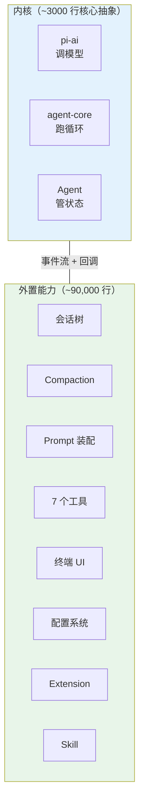

# 第 30 章：极简核心，能力外置

> **定位**：本章提炼 pi 的核心设计方法论。
> 前置依赖：全书前 29 章。
> 适用场景：当你想把 pi 的设计经验应用到自己的系统中。

## 内核只做三件事

回顾前面的章节，pi 的内核（pi-ai + pi-agent-core）只做三件事：

1. **调模型**（第 4-7 章）：统一 20+ 家厂商，流式事件，跨模型消息变换
2. **跑循环**（第 8-9 章）：无状态的双层循环，三阶段工具执行管道
3. **管状态**（第 10 章）：有状态的 Agent 壳，事件订阅，消息队列

其余所有功能 — 会话持久化、上下文压缩、system prompt 装配、工具实现、UI 渲染、配置管理 — 都在内核之外。

### 用行数说话

pi-mono 共约 120,000 行 TypeScript（不含测试和生成代码）。内核的占比很小：

| 包 | 行数 | 职责 | 层级 |
|---|------|------|------|
| pi-ai | ~26,875 | 模型调用、provider 注册、消息变换 | 内核 |
| pi-agent-core | ~1,859 | agent 循环、事件系统、状态管理 | 内核 |
| **内核合计** | **~28,734** | | **24%** |
| pi-coding-agent | ~42,058 | 会话管理、prompt 装配、工具实现、配置 | 产品层 |
| pi-tui | ~10,764 | 终端 UI 渲染 | UI 层 |
| mom | ~4,046 | Slack bot 适配 | 产品壳 |
| pods | ~1,773 | GPU 部署工具 | 工具 |
| web-ui | ~14,623 | Web UI | UI 层 |

注意 pi-ai 的行数较多，是因为它包含了 20+ 家 provider 的适配代码（每个 provider 约 200-500 行的流式转换逻辑）。**真正的核心抽象**（`StreamFunction`、`Context`、`Model` 类型、`agentLoop`、`Agent` 类）加起来不到 3000 行。

pi-agent-core 只有 ~1,859 行，是整个 monorepo 中最小的包。但它定义了最关键的协议：agent 循环、事件类型、工具接口、回调钩子。



这种比例（核心 24%，外围 76%）不是偶然的。它反映了一个判断：**agent 系统的核心应该是一个协议（事件流 + 回调），而不是一个框架（内建的功能集合）。**

## 协议 vs 框架：用例子说清楚

"协议式设计"和"框架式设计"是两种根本不同的架构策略。用具体例子对比：

### 例子 1：添加一个新工具

**框架式**（假设的 AgentFramework）：
```typescript
// 框架内建了工具注册系统，你在框架的约束内添加
class MyAgent extends AgentFramework {
  @Tool({ name: "search", schema: searchSchema })
  async search(query: string) {
    return await doSearch(query);
  }
}
```

**协议式**（pi）：
```typescript
// 工具只是一个满足 AgentTool 接口的对象
const searchTool: AgentTool<{ query: string }> = {
  name: "search",
  schema: { /* JSON Schema */ },
  async execute({ args }) {
    return await doSearch(args.query);
  },
};
// 传入 Agent 的 initialState.tools 即可
```

区别不在语法糖，而在**控制权**。框架式设计中，工具的生命周期由框架管理（注册、发现、权限检查都内建）。协议式设计中，工具只是一个数据结构，产品层可以自由地创建、组合、替换。

### 例子 2：实现上下文压缩

**框架式**：
```typescript
// 框架内建了 compaction 策略
agent.setCompactionStrategy("summarize", {
  threshold: 100000,
  model: "claude-haiku",
});
```

**协议式**（pi）：
```typescript
// transformContext 回调可以做任何事
const config: AgentLoopConfig = {
  transformContext: (messages) => {
    // 你自己决定压缩策略
    if (estimateTokens(messages) > threshold) {
      return compactMessages(messages);
    }
    return messages;
  },
};
```

框架式更方便（一行配置），协议式更灵活（可以实现框架没预见到的策略）。

### 例子 3：多产品复用

这是协议式设计的杀手级优势。pi 的同一个内核被三个完全不同的产品使用：

```
pi CLI（终端 coding agent）
├── 使用：TUI 渲染、本地文件系统工具、交互式确认
├── 不使用：Slack API、Docker sandbox

mom（Slack bot）
├── 使用：Docker sandbox、Slack 消息输出、事件调度
├── 不使用：TUI、交互式确认、本地工具权限

web-ui（浏览器 IDE）
├── 使用：RPC 通信、WebSocket 事件流
├── 不使用：TUI、Slack API、Docker sandbox
```

如果内核是框架式的（内建了 TUI、本地文件工具、权限 popup），mom 和 web-ui 要么 fork 框架，要么在框架上面做大量适配。pi 的协议式内核没有这些假设 — 它只定义"模型怎么调"和"循环怎么跑"，产品层自行决定其余一切。

## 与竞品的架构对比

以下对比是**结构性的**（架构选择），不是**评价性的**（孰优孰劣）。每种选择都有其适用场景。

### Claude Code

Claude Code 是 Anthropic 官方的 CLI agent。架构对比：

| 维度 | pi | Claude Code |
|------|------|-------------|
| 模型层 | 多 provider 抽象 | 单一 Anthropic API |
| 循环引擎 | 可组合纯函数（agentLoop） | 内建循环 + 工具管理 |
| 工具系统 | 外置，通过接口注入 | 内建标准工具集 |
| 扩展机制 | Extension API + Skill | Slash command + CLAUDE.md |
| 会话管理 | 外置 SessionManager | 内建会话持久化 |
| UI 层 | 独立的 pi-tui 包 | 内建终端 UI |
| 多产品 | CLI / Slack / Web | CLI 为主，headless 模式 |

关键差异：Claude Code 是**单一产品优化**的设计 — 它只需要支持一个 provider（Anthropic）、一个 UI（终端）、一组工具。这让它可以把更多功能内建，降低上手成本。pi 是**多产品基座**的设计 — 它需要支持多个 provider、多个 UI、多个产品形态，所以必须把更多东西外置。

### Cursor / Windsurf（IDE Agent）

| 维度 | pi | IDE Agent（Cursor 类） |
|------|------|----------------------|
| 宿主 | 独立进程 | IDE 插件（VS Code extension） |
| 编辑操作 | 工具调用 → Edit/Write | 直接操作 IDE API |
| 上下文 | 手动管理（transformContext） | IDE 提供语义索引 |
| 文件导航 | Glob/Grep 工具 | LSP + 语义搜索 |
| 多模型 | 用户可切换 | 内建路由（不同任务用不同模型） |

关键差异：IDE agent 有一个巨大优势 — IDE 本身就是上下文源（打开的文件、编辑历史、语言服务器）。pi 作为独立进程，需要通过工具（Glob、Grep、Read）来获取这些信息。但 pi 的独立性也意味着它不受 IDE 限制 — 可以在 Slack、Web、CI/CD 中运行。

### Aider

| 维度 | pi | Aider |
|------|------|-------|
| 语言 | TypeScript | Python |
| 编辑策略 | LLM 生成 edit/write 工具调用 | LLM 生成 unified diff |
| 循环模型 | 通用 agent 循环 | 专注于 code edit 循环 |
| Git 集成 | 通过 bash 工具 | 内建 git 操作 |
| 上下文管理 | 手动 + transformContext | Repo map + 文件标签 |

关键差异：Aider 是**垂直整合**的 coding assistant — git、diff、编辑、测试一体化。pi 是**水平分层**的 agent 基座 — coding 只是其中一个用例。Aider 在纯代码编辑场景中更高效（diff 策略比 tool call 更节省 tokens），但 pi 的通用循环可以做 Aider 做不到的事（Slack bot、自动化管道等）。

## "不内建"的判断标准

pi 如何决定一个功能是内建还是外置？有三个判断标准：

### 1. 这个功能是否产品相关？

如果功能的实现取决于产品形态，就应该外置。

- **权限确认**：CLI 弹终端 popup，Slack 发消息让用户回复，Web 弹 modal → **外置**
- **工具执行**：CLI 在本地执行，mom 在 Docker 中执行 → **外置**
- **输出渲染**：CLI 用 TUI，Slack 用 mrkdwn，Web 用 HTML → **外置**
- **流式事件格式**：所有产品都需要相同的事件流 → **内建**

### 2. 这个功能是否有多种合理实现？

如果功能有多种同样合理的实现方式，就应该外置为回调或接口。

- **compaction 策略**：可以用 LLM 总结、可以按时间截断、可以按 token 预算裁剪 → **外置**为 `on("session_before_compact", ...)` 钩子
- **上下文变换**：可以注入 plan 指令、可以过滤历史、可以动态切换模型 → **外置**为 `transformContext` 回调
- **消息序列化**：每个 LLM 的消息格式不同 → **内建**在 provider 层统一处理

### 3. 这个功能是否需要系统级别的一致性？

如果功能的不一致会导致系统行为不可预测，就应该内建。

- **事件类型**：所有组件必须用相同的事件定义 → **内建**
- **工具执行管道**：prepare/execute/finalize 三阶段必须统一 → **内建**
- **工具的具体 schema**：不同工具有不同参数 → **外置**

## 与竞品的设计对比（决策矩阵）

| 设计维度 | pi | 典型框架式 Agent |
|---------|------|----------|
| Sub-agents | 不内建，用 tool call 组合 | 内建 multi-agent orchestration |
| 权限控制 | beforeToolCall 钩子 | 内建 permission popup |
| Plan mode | transformContext 组合 | 内建 plan/execute 模式 |
| 会话存储 | SessionManager（产品层） | 内建 memory store |
| Prompt 管理 | AGENTS.md + skills | 内建 prompt registry |
| 模型路由 | 产品层选择 model | 内建 model router |
| 错误恢复 | 产品层实现 retry | 内建 retry + fallback |
| 可观测性 | 事件流 + 订阅 | 内建 tracing/logging |

pi 的每个"不内建"都对应一个"用更底层的机制组合出来"。不是没想到，是故意没做。

## 极简核心的代价

诚实地说，极简核心不是没有代价：

**上手成本高**。新用户面对的是"洋葱架构" — pi-ai、pi-agent-core、pi-coding-agent、pi-tui 四层，每层有自己的类型和回调。理解一个"消息从用户输入到模型回复"的完整路径，需要穿越所有四层。

**重复劳动**。不同的产品壳（CLI、mom、web-ui）各自实现了类似的功能（session 加载、system prompt 构建、工具权限）。虽然它们各有差异，但重复的部分不小。

**文档负担**。内建功能可以在框架文档中一次性说明。外置功能需要每个产品各自文档化其组合方式。

**调试困难**。bug 可能出现在内核、产品层、或两者的交互中。分层越多，追踪问题的路径越长。

这些代价是 pi 为多产品适应性付出的"税"。对于只需要单一产品的团队，框架式设计可能是更好的选择。

## 取舍分析

### 得到了什么

**极致的适应性**。同一个内核跑在终端（pi CLI）、Slack（mom）、浏览器（pi-web-ui）、GPU 集群（pods）。每个产品只需要实现自己需要的"壳"。内核的 24% 代码驱动了 100% 的产品形态。

**长期可维护性**。内核的变化不影响产品层（只要协议不变）。产品层的变化不影响内核。这种解耦在 monorepo 中已经得到验证 — mom 和 web-ui 可以独立演进，不需要协调内核修改。

### 放弃了什么

**上手成本**。用户需要理解"洋葱架构"的每一层才能有效使用 pi。没有"开箱即用"的体验 — 你要么接受默认配置，要么深入理解系统才能定制。

**开发速度**。在框架式系统中，添加一个新功能可能只需要调一个 API。在 pi 中，你可能需要理解三层的交互才能找到正确的注入点。

---

### 版本演化说明
> 本章核心分析基于 pi-mono v0.66.0 的架构快照。
> 极简核心的设计哲学从 pi 的第一个版本就确立了，后续版本只是在不扩大内核的前提下
> 通过 extension、skill、回调等机制添加新能力。行数统计可能随版本变化，
> 但内核与外围的比例预计保持稳定。
